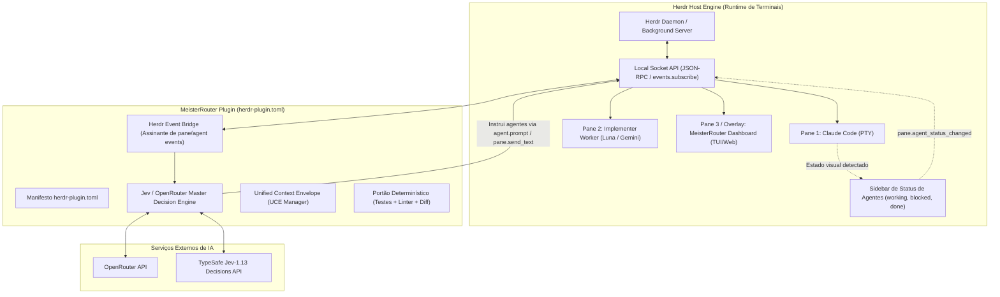
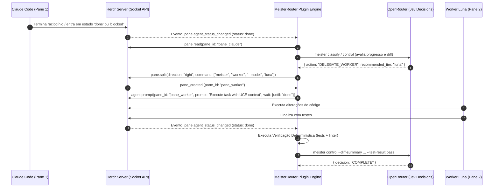
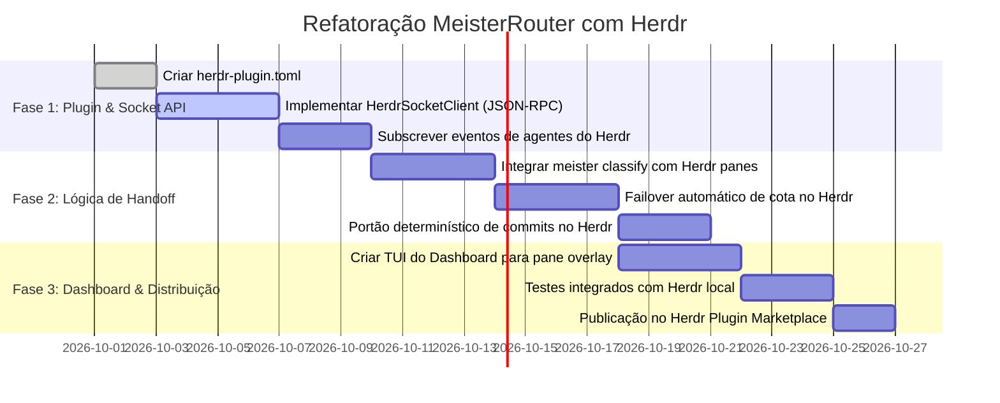

# Análise Arquitetural: MeisterRouter no Ecossistema Herdr

**Documento:** Parecer de Engenharia & Especificação de Arquitetura  
**Papel:** Engenheiro Sênior de Harnesses de LLM & Arquiteto de Sistemas de IA  
**Data:** 26 de Setembro de 2026  
**Status:** Proposta de Integração Arquitetural  

---

## 1. Visão Executiva e Mudança de Paradigma

Na arquitetura original de gerenciamento multi-agente, o maior gargalo técnico identificado foi a necessidade de construir do zero:
1. Uma camada de multiplexação de terminais e controle de pseudo-terminais (PTY/ANSI);
2. Um daemon de persistência de processos resiliente a desconexões;
3. Um detector heurístico de estados de agentes CLI (*working*, *blocked*, *idle*).

A introdução do **Herdr** ([herdr.dev/docs/](https://herdr.dev/docs/)) altera drasticamente essa equação de engenharia. O Herdr é um **gerenciador de workspaces de terminal construído especificamente para agentes de código de IA**, oferecendo nativamente:
* Servidor em background que preserva sessões e processos PTY ativos;
* Detecção automática de agentes de mercado (**Claude Code**, **OpenAI Codex**, **Aider** e outros);
* **Socket API bidirecional** completa via JSON-RPC sobre UNIX Domain Socket (`HERDR_SOCKET_PATH`) e CLI (`HERDR_BIN_PATH`);
* Sistema extensível de **Plugins** (`herdr-plugin.toml`) com suporte a *startup hooks*, *actions*, *event subscriptions* e criação declarativa de *panes/popups*.

> **Decisão Estratégica:** Em vez de o MeisterRouter reinventar a infraestrutura de terminais, **o MeisterRouter deve ser arquitetado como um Herdr Ecosystem Plugin + Master Decision Engine**, delegando a gerência de PTYs e layouts ao Herdr e focando 100% da sua inteligência no roteamento de modelos, controle de custos e portão determinístico de evidências.

---

## 2. Nova Arquitetura: MeisterRouter sobre o Herdr



### 2.1 Separação de Responsabilidades

| Responsabilidade | Quem Executa? | Primitiva Utilizada |
|---|---|---|
| **Alocação de PTY e multiplexação** | **Herdr** | `pane.split`, `pane.layout`, `pane.close` |
| **Persistência de terminal (detach/SSH)** | **Herdr** | Arquitetura Cliente/Servidor do Herdr |
| **Detecção de vida/bloqueio do agente** | **Herdr** | Screen detection interna (`working`, `blocked`, `done`) |
| **Decisão de Roteamento de Modelo** | **MeisterRouter** | OpenRouter (`typesafe/jev-1.13` + Gemini 3.8 / GPT-6 Luna) |
| **Handshake de Maestria & Failover** | **MeisterRouter** | Herdr Socket API (`events.subscribe` + `agent.prompt`) |
| **Validação de Evidências Determinísticas** | **MeisterRouter** | Git Diff + Pytest/Vitest Runner + Linter Gate |

---

## 3. Abstração e Inter-Harness Communication via Herdr API

### 3.1 Eliminando a necessidade de Drivers PTY Customizados

O Herdr já encapsula os detalhes dos processos filhos. Através do **Herdr Socket API**, o MeisterRouter não precisa manipular descritores de arquivo ou ANSI raw modes diretamente. Ele interage com os agentes via JSON-RPC de alto nível:

1. **Despacho de Tarefas:** `agent.prompt`  
   Permite enviar um prompt ao agente já acoplado ao parâmetro `wait: { until: "done", timeout_ms: 120000 }`.
2. **Leitura de Saída:** `agent.read` ou `pane.read`  
   Permite extrair os últimos $N$ tokens ou o buffer limpo do terminal sem artefatos ANSI corrompidos.
3. **Inspeção de Estado:** `agent.list` e `agent.explain`  
   Identifica se o harness é Claude Code, Codex ou Aider e o motivo da classificação (`blocked`, `working`).

### 3.2 O Protocolo de Handoff sobre o Herdr

Quando o arquiteto (ex: Claude Code) conclui seu plano e precisa repassar a implementação para o modelo econômico (ex: GPT-6 Luna), ou quando ocorre uma falha:



---

## 4. Sistema de Hooks e Failover Imediato com Herdr

### 4.1 Onde os Hooks Devem Residir no Herdr?

O Herdr possui pontos de extensão nativos ideais para os hooks do MeisterRouter:

1. **`[[events]]` no Manifesto do Plugin:**
   O Herdr dispara webhooks locais para o plugin quando ocorrem eventos no workspace:
   ```toml
   [[events]]
   on = "pane.agent_status_changed"
   command = ["meister", "herdr-hook", "--event", "agent_status"]
   ```
2. **Conexão Persistente via `events.subscribe` (Recomendada para Latência Zero):**
   Durante o startup do plugin (`[[startup]]`), o daemon do MeisterRouter abre uma conexão com o `HERDR_SOCKET_PATH` e assina os tópicos:
   * `pane.agent_status_changed`
   * `pane.output_matched` (usando regex do Herdr para capturar HTTP 429/402 em tempo real)
   * `pane.process_exited`

### 4.2 Failover de Cota e Rate-Limit em Milissegundos

Quando o Claude Code ou qualquer harness atinge o limite de cota:
1. O Herdr detecta a mensagem no buffer ou o status muda para `blocked` / erro de execução.
2. O **MeisterRouter Event Bridge** captura o evento no socket local.
3. **Ação Imediata de Failover:**
   * O MeisterRouter emite um `pane.send_keys(pane_id, "ctrl+c")` para interromper o consumo de tokens falho.
   * Dispara um `worktree` ou captura o `git status` atual.
   * Cria ou foca o pane de contingência (**Gemini 3.8 Flash** via OpenRouter).
   * Injeta o histórico limpo e continua a execução sem intervenção humana manual.

---

## 5. Estrutura do Plugin MeisterRouter no Herdr

O MeisterRouter pode ser empacotado como um plugin padrão do Herdr, permitindo instalação com um comando.

### 5.1 Manifesto: `herdr-plugin.toml`

```toml
id = "dev.meisterrouter.orchestrator"
name = "MeisterRouter"
version = "1.0.0"
min_herdr_version = "0.7.0"
description = "Deterministic Multi-Model Orchestration & Cost-Optimized Routing"
platforms = ["linux", "macos"]

# Comando executado assim que o servidor Herdr inicializa
[[startup]]
command = ["meister", "daemon", "--start"]

# Ações acessíveis via menu ou atalhos do Herdr
[[actions]]
id = "classify-task"
title = "MeisterRouter: Classificar Tarefa no Pane Ativo"
contexts = ["workspace", "pane"]
command = ["meister", "herdr-action", "classify"]

[[actions]]
id = "verify-gate"
title = "MeisterRouter: Executar Portão Determinístico"
contexts = ["workspace"]
command = ["meister", "herdr-action", "verify"]

[[actions]]
id = "auto-orchestrate"
title = "MeisterRouter: Iniciar Orquestração Multi-Agente"
contexts = ["workspace"]
command = ["meister", "herdr-action", "orchestrate"]

# Painel Dashboard do MeisterRouter integrado como Overlay no Herdr
[[panes]]
id = "dashboard"
title = "MeisterRouter Telemetry & Cost Dashboard"
placement = "overlay"
command = ["meister", "dashboard", "--tui"]

# Atalho de teclado sugerido dentro do Herdr
[[keys.command]]
key = "prefix+m"
type = "plugin_action"
command = "dev.meisterrouter.orchestrator.auto-orchestrate"
description = "Ativar orquestrador MeisterRouter"
```

---

## 6. DX e Onboarding: A Grande Vantagem do Herdr

Com a adoção do Herdr, a experiência do desenvolvedor (DX) passa de um processo complexo de configuração de múltiplos terminais para um fluxo trivial:

```bash
# 1. Instalar o Herdr (se ainda não tiver)
curl -fsSL https://herdr.dev/install.sh | sh

# 2. Instalar o MeisterRouter
pip install meisterrouter

# 3. Vincular o MeisterRouter como Plugin no Herdr (1 comando)
herdr plugin link ~/.local/share/meisterrouter
# ou quando publicado no GitHub:
# herdr plugin install cristianocarvalho/meisterrouter

# 4. Iniciar o Herdr no projeto
herdr
```

Ao abrir o Herdr:
1. O desenvolvedor já tem mouse navigation, split panes e abas limpas.
2. O MeisterRouter roda como daemon em background, escutando a Socket API do Herdr.
3. Se um agente Claude Code esgotar a cota ou precisar de ajuda de um worker rápido (GPT-6 Luna), o MeisterRouter abre os panes necessários automaticamente, sem o desenvolvedor precisar criar sessões Tmux na mão.

---

## 7. Blueprint de Refatoração Atualizado



### Entregáveis Técnicos Imediatos:
1. **[`meister/herdr/client.py`](https://github.com/CristianonCarvalho/meisterrouter/blob/main/meister/herdr/client.py):** Cliente assíncrono para o socket UNIX do Herdr (`HERDR_SOCKET_PATH`), com suporte a `agent.prompt`, `pane.split` e assinatura de `pane.agent_status_changed`.
2. **[`herdr-plugin.toml`](https://github.com/CristianonCarvalho/meisterrouter/blob/main/herdr-plugin.toml):** Manifesto de plugin do Herdr registrando ações de classificação, verificação determinística e o dashboard.
3. **[`meister/herdr/bridge.py`](https://github.com/CristianonCarvalho/meisterrouter/blob/main/meister/herdr/bridge.py):** Ponte de eventos que conecta o ciclo de vida dos agentes no Herdr às decisões do Jev (`meister.jev`).
