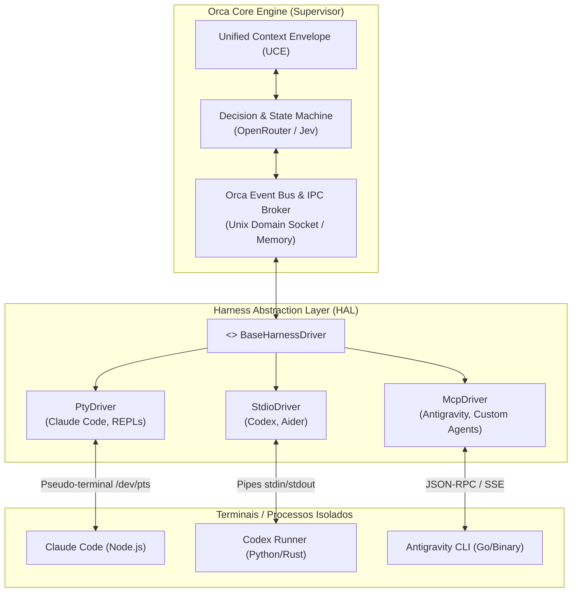
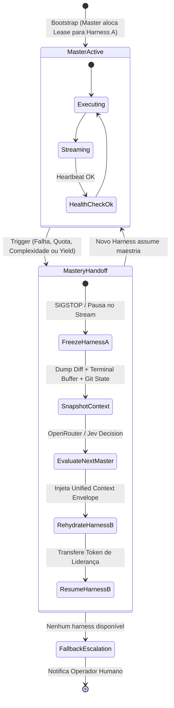
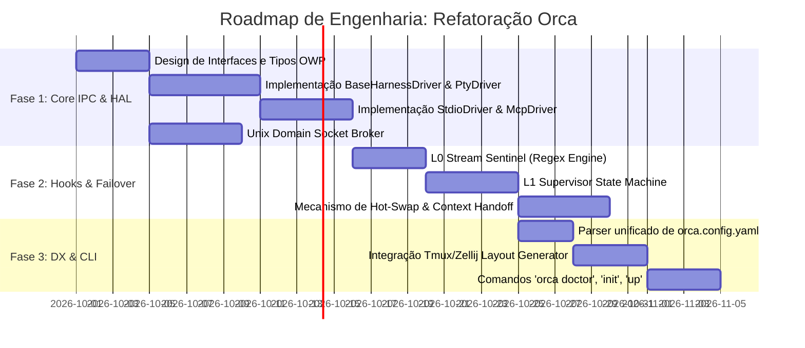

# Auditoria Técnica e Arquitetura de Referência: Projeto Orca

**Documento:** Parecer Arquitetural & Blueprint de Engenharia  
**Papel:** Engenheiro Sênior de Harnesses de LLM & Arquiteto de Sistemas de IA  
**Data:** 26 de Setembro de 2026  
**Status:** Proposta Arquitetural para Implementação  

---

## Sumário Executivo

O projeto **Orca** tem como desafio coordenar múltiplos agentes autônomos baseados em terminais heterogêneos (**Claude Code**, **Antigravity CLI**, **OpenAI Codex**, **Aider**), sob a tutela de um **Modelo Mestre** de decisão probabilística/determinística (via OpenRouter, ex: `typesafe/jev-1.13` ou LLMs de alta fidelidade).

Para que o Orca não se torne um aglomerado frágil de scripts `pexpect` e pipes de shell, sua fundação deve ser desenhada como um **Supervisor de Processos Reativo com Camada de Abstração de Harness (HAL - Harness Abstraction Layer)**, barramento IPC bidirecional e máquina de estados para transição de liderança (*mastery handoff*).

Abaixo apresentamos a auditoria técnica completa dividida nos três eixos solicitados, culminando no **Blueprint de Refatoração**.

---

## 1. Arquitetura Reutilizável (Agnóstica a Harnesses)

### 1.1 O Desafio da Heterogeneidade de Harnesses

Os harnesses de LLM em 2026 operam sob paradigmas de I/O fundamentalmente distintos:
1. **REPL Interativo / ANSI PTY:** *Claude Code* e ferramentas de terminal desenhadas para humanos exigem um pseudo-terminal (PTY) completo, interceptando sequências de escape ANSI, raw mode e sinais POSIX (`SIGINT`, `SIGWINCH`).
2. **Headless / JSON-RPC / stdio:** *OpenAI Codex* e *Aider* aceitam flags como `--json`, `--headless` ou pipes diretos de entrada/saída.
3. **MCP Nativo / Protocol-driven:** Ferramentas modernas como *Antigravity* operam nativamente com servidores/clientes MCP (Model Context Protocol), expondo endpoints de ferramentas e streaming de eventos.

### 1.2 A Camada de Abstração: *Harness Abstraction Layer (HAL)*

Para desacoplar o Orca da implementação específica de cada CLI, adotamos o padrão **Driver/Adapter** com um contrato estrito de ciclo de vida:



#### Contrato da Interface Abstrata (`harness_driver.py`)

```python
from abc import ABC, abstractmethod
from typing import AsyncIterator, Optional, Dict, Any
from dataclasses import dataclass
from enum import Enum

class HarnessState(str, Enum):
    INITIALIZING = "INITIALIZING"
    IDLE = "IDLE"
    THINKING = "THINKING"
    EXECUTING_TOOL = "EXECUTING_TOOL"
    WAITING_INPUT = "WAITING_INPUT"
    ERROR = "ERROR"
    TERMINATED = "TERMINATED"

@dataclass
class StreamChunk:
    source_harness: str
    channel: str  # "stdout", "stderr", "ipc", "telemetry"
    content: str
    timestamp: float

class BaseHarnessDriver(ABC):
    """Driver agnóstico para controle e telemetria de um harness de LLM."""

    @abstractmethod
    async def spawn(self, cwd: str, env: Dict[str, str], args: list[str]) -> None:
        """Inicializa o subprocesso (aloca PTY, pipe ou conexão de rede)."""
        pass

    @abstractmethod
    async def send_input(self, payload: str, end_sequence: str = "\n") -> None:
        """Injeta comandos ou texto para o agente sem corromper o estado do terminal."""
        pass

    @abstractmethod
    async def stream_output(self) -> AsyncIterator[StreamChunk]:
        """Consome o fluxo de saída em tempo real com normalização de ANSI/tokens."""
        pass

    @abstractmethod
    async def get_state(self) -> HarnessState:
        """Determina o estado atual do agente (analisando stream e saídas)."""
        pass

    @abstractmethod
    async def inject_context(self, context_envelope: Dict[str, Any]) -> bool:
        """Injeta contexto semântico ou instrução de maestria no harness."""
        pass

    @abstractmethod
    async def terminate(self, grace_period_ms: int = 1500) -> int:
        """Encerra graciosamente (SIGTERM -> SIGKILL) e retorna exit code."""
        pass
```

### 1.3 Barramento de Comunicação e Troca de Mensagens (IPC)

Em vez de pipes simples de shell, o Orca deve utilizar **UNIX Domain Sockets (UDS)** locais com comunicação assíncrona baseada em eventos (`/tmp/orca-{session_id}.sock`).

#### Protocolo Padronizado: *Orca Wire Protocol (OWP)*
Cada frame trafegado entre os terminais e o núcleo é encapsulado em JSON serializado com tipagem forte:

```json
{
  "$schema": "https://orca.dev/schemas/v1/message.json",
  "id": "msg_01J8F9XW3Q9...",
  "correlation_id": "corr_01J8F9XW...",
  "timestamp": 1758897800.123,
  "source": {
    "harness_id": "claude-code-primary",
    "role": "architect"
  },
  "target": {
    "harness_id": "orca-core",
    "role": "master"
  },
  "type": "MASTERY_HANDOFF_REQUEST",
  "payload": {
    "reason": "RATE_LIMIT_PREDICTED",
    "tokens_remaining_estimated": 450,
    "last_stable_git_sha": "a3f81e9",
    "working_diff_summary": "Created test suite for auth module; router untested",
    "context_handoff": {
      "active_task": "Implement OAuth2 PKCE flow",
      "scratchpad": "Tokens are refreshed via Redis; pending unit test mocks"
    }
  }
}
```

### 1.4 Repasse de "Mestria" e Máquina de Estados (State Machine)

A "mestria" (capacidade de tomar decisões arquiteturais e coordenar sub-tarefas) não é fixa em um único processo. O Modelo Mestre via OpenRouter governa a eleição através de **Leases Temporários com Heartbeat**:



**Mecanismo de Handshake de Maestria:**
1. **`ACQUIRE_MASTERY_LOCK`**: O agente mestre atual mantém um lock com lease de 30 segundos no socket IPC.
2. **`YIELD_MASTERY` / `PREEMPT_MASTERY`**: Ocorre quando o harness atual:
   - Conclui a decomposição arquitetural e despacha a implementação para os workers.
   - Entra em degradação de cota (ver Seção 2).
   - O decisor OpenRouter detecta loop cognitivo (alucinação cíclica em 3 retries consecutivos).
3. **`HYDRATE_CONTEXT`**: O Orca compila o **Unified Context Envelope (UCE)** (árvore git, diff, histórico sumarizado de decisões e erros mais recentes) e o injeta no novo harness antes de liberar o prompt de execução.

---

## 2. Sistema de Hooks Reativos e Ciclos de Vida

### 2.1 Análise de Viabilidade e Camadas de Residência

Para alcançar um **failover com latência zero** quando ocorrer exaustão de limites (HTTP 429), cota financeira (HTTP 402 / out-of-credits) ou pane de runtime, analisamos os três locais potenciais para os hooks:

| Camada | Ponto de Injeção | Prós | Contras | Veredito |
|---|---|---|---|---|
| **A. Core do Orca (Supervisor)** | Monitoramento do stream IPC/PTY central | Visão global do sistema, decide trocas de processo e reencaminhamento | Pode acumular buffer de saída antes de identificar falhas se o stream for bufferizado | **Essencial para a State Machine & Orquestração** |
| **B. Terminal Shims / Wrappers** | Wrapper em torno do binário (ex: `bin/claude` -> intercepta `pty`/`execve`) | **Latência zero**, acesso cru a descritores `stdout`/`stderr`, exit codes e inspeção em tempo real de chamadas HTTP/SSL (se configurado proxy local) | Exige injeção no PATH ou wrapper binário | **Obrigatório para detecção imediata de Quotas/Crashes** |
| **C. SDK / Plugins dos Harnesses** | Extensões nativas (ex: `.claude/hooks/`, plugins Cursor) | Contexto semântico rico da LLM interna | Frágil, nem todo harness expõe hooks, falha se o próprio processo entrar em deadlock | **Opcional (apenas como telemetria complementar)** |

### 2.2 Proposta: Arquitetura Híbrida de 2 Níveis (*Two-Tier Reactive Hooks*)

A estratégia ótima combina **L0 (Process/PTY Tap Wrapper)** com **L1 (Core Supervisor Engine)**:

```
[Harness Process (ex: Claude Code)]
              │  (stdout / stderr / raw pty)
              ▼
    ╔═════════════════════════════════════════════════╗
    ║  L0: Orca PTY/Stream Tap Wrapper                ║
    ║  - Regex Engine em Streaming (DFA / Aho-Corasick║
    ║  - Matchers: HTTP 429, 402, "credit balance"   ║
    ║  - Interceptação de Sinais de Morte/Exit Code   ║
    ╚═════════════════════════════════════════════════╝
              │ 
              │ (Emite OWP Event imediato via Unix Socket)
              ▼
    ╔═════════════════════════════════════════════════╗
    ║  L1: Orca Core Lifecycle Engine                 ║
    ║  - Hook `on_quota_exhausted` disparado em < 5ms ║
    ║  - Freeze no Harness Falho (SIGSTOP)            ║
    ║  - Transição de Estado & Failover Hot-Swap      ║
    ╚═════════════════════════════════════════════════╝
```

#### Gatilhos e Taxonomia do Ciclo de Vida

```python
class LifecycleHookTrigger(str, Enum):
    PRE_DISPATCH = "pre_dispatch"          # Valida saldo OpenRouter, git clean, dependências
    POST_DISPATCH = "post_dispatch"        # Log de latência, snapshot inicial de AST
    STREAM_TAP = "stream_tap"              # Análise em tempo real do stream de tokens
    STDERR_ALERT = "stderr_alert"          # Interceptação de warnings/erros não fatais
    ON_QUOTA_EXHAUSTED = "on_quota"        # Rate limit, 402, 429, saldo zerado
    ON_NON_ZERO_EXIT = "on_exit_failure"   # Processo abortou ou sofreu SIGSEGV/SIGKILL
    PRE_COMMIT_VERIFY = "pre_commit"       # Portão determinístico (testes, linter, typecheck)
```

#### Implementação de Detecção de Quota com Latência Zero (`stream_sentinel.py`)

O tap opera em nível de pipeline assíncrono com padrão *matcher sliding-window*, sem bloquear o rendering do terminal:

```python
import re
import asyncio
from typing import Callable, Coroutine

PATTERNS_FAILOVER = [
    re.compile(r"(rate[ _-]limit|status[ _-]code[ :]+429|quota[ _-]exceeded)", re.IGNORECASE),
    re.compile(r"(insufficient[ _-]funds|out[ _-]of[ _-]credits|status[ _-]code[ :]+402)", re.IGNORECASE),
    re.compile(r"(model[ _-]overloaded|capacity[ _-]reached|503[ _-]service[ _-]unavailable)", re.IGNORECASE),
    re.compile(r"(credit balance is too low|usage limit reached)", re.IGNORECASE)
]

class StreamSentinel:
    """Escuta o buffer do PTY/pipe e dispara callbacks de emergência em tempo real."""

    def __init__(self, on_quota_trigger: Callable[[str], Coroutine]):
        self.on_quota_trigger = on_quota_trigger
        self.buffer_window = ""
        self.max_window_size = 2048

    async def ingest_chunk(self, chunk: str) -> None:
        self.buffer_window = (self.buffer_window + chunk)[-self.max_window_size:]
        
        for pattern in PATTERNS_FAILOVER:
            match = pattern.search(self.buffer_window)
            if match:
                matched_text = match.group(0)
                # Dispara o failover imediatamente antes de esperar o processo morrer
                asyncio.create_task(self.on_quota_trigger(matched_text))
                break
```

---

## 3. Instalabilidade e DX (Developer Experience)

### 3.1 Princípios de DX: "Zero-Friction Multi-Agent"

Para eliminar o atrito de múltiplos ambientes, o desenvolvedor não deve:
- Abrir 4 janelas manuais de terminal.
- Exportar 5 variáveis de ambiente diferentes em `.zshrc`.
- Instalar dependências Python, Node e Go manualmente em pastas isoladas.

### 3.2 Estratégia de Distribuição e Binário Unificado

Propõe-se a distribuição do CLI do Orca via duas vias prioritárias:

1. **Homebrew / Standalone Binary (Recomendado para macOS/Linux):**
   ```bash
   brew tap orca-ai/orca
   brew install orca
   ```
   *Implementação:* Binário único compilado em Go ou Rust (ou empacotado via PyInstaller/Nuitka) com auto-checagem de dependências de sistema (`tmux`, `zellij`, `git`).
2. **NPM/NPX Bootstrap (Para ecossistemas Node/Fullstack):**
   ```bash
   npx orca-manager init
   ```

### 3.3 Configuração Declarativa Única: `orca.config.yaml`

Um único arquivo na raiz do repositório dita a topologia, modelos, cotas e topologia de fallback:

```yaml
version: "1.0"
session:
  name: "orca-auth-refactor"
  workspace_root: "."

master:
  provider: "openrouter"
  model: "typesafe/jev-1.13"
  decision_policy: "strict_deterministic"
  api_key_env: "OPENROUTER_API_KEY"

harnesses:
  architect:
    driver: "pty"
    command: "claude"
    args: ["--dangerously-skip-permissions"]
    env:
      ANTHROPIC_MODEL: "claude-3-7-sonnet-latest"
    fallback_target: "deep_reasoner"

  deep_reasoner:
    driver: "stdio"
    command: "meister-worker"
    args: ["--model", "gemini-3.8-flash"]
    fallback_target: "fast_coder"

  fast_coder:
    driver: "stdio"
    command: "meister-worker"
    args: ["--model", "gpt-6-luna"]
    fallback_target: null

mux:
  engine: "auto" # "zellij", "tmux" ou "tui"
  layout:
    - name: "Master Decision Log"
      source: "orca-events"
      size: "30%"
    - name: "Active Harness Terminal"
      source: "active-harness"
      size: "70%"

failover:
  max_retries_per_tier: 2
  auto_git_stash_on_crash: true
  notify_desktop_on_escalate: true
```

### 3.4 Workflow de Onboarding em 2 Minutos

O fluxo de onboarding do desenvolvedor reduz-se a três passos declarativos:

```bash
# 1. Executa o setup interativo (checa binários e valida API keys)
orca doctor

# 2. Inicializa os templates e hooks no projeto
orca init

# 3. Sobe a malha de terminais orquestrada
orca up
```

#### O que o comando `orca up` executa sob o capô:
1. Lê o `orca.config.yaml`.
2. Cria o socket IPC em `/tmp/orca-run.sock`.
3. Inicia o daemon do Supervisor em background.
4. Detecta o multiplexador disponível (**Zellij** com fallback para **Tmux** ou TUI nativa via biblioteca terminal).
5. Abre as sessões conectadas ao wrapper L0 (`orca run --driver pty -- claude`), dividindo os quadrantes na tela do desenvolvedor sem que ele precise configurar janelas manualmente.

---

## 4. Blueprint de Refatoração

Abaixo estruturamos o plano de transição para consolidar o repositório atual em direção à arquitetura **Orca**.



### Fase 1: Abstração de Harnesses e Núcleo IPC
* **Objetivo:** Isolar totalmente os comandos CLI dos agentes da lógica de decisão do mestre.
* **Tarefas Técnicas:**
  1. Criar módulo `orca/hal/` contendo `base.py`, `pty_driver.py` (usando `ptyprocess` ou `pyte`), `stdio_driver.py` e `mcp_driver.py`.
  2. Implementar `orca/ipc/broker.py`: Servidor asyncio UDS capaz de rotear payloads OWP entre múltiplos processos conectados.
  3. Migrar as decisões do `meister/jev.py` para dentro de `orca/core/decision_engine.py`, generalizando o consumo via OpenRouter.

### Fase 2: Sistema Reativo de Hooks e Tolerância a Falhas
* **Objetivo:** Garantir failover imediato para esgotamento de cotas e erros irrecuperáveis.
* **Tarefas Técnicas:**
  1. Implementar o `StreamSentinel` com detecção não blocante de padrões HTTP 429/402 e rate limits.
  2. Criar a máquina de estados `MasteryStateMachine` com persistência de leases e tokens de liderança.
  3. Implementar a rotina de extração e reidratação do **Unified Context Envelope (UCE)**:
     - Captura de status do Git e diff staged/unstaged.
     - Histórico dos últimos N comandos executados no buffer do PTY.
     - Injeção das instruções de continuidade no harness substituto.

### Fase 3: Experiência do Desenvolvedor (DX) e Orquestração de Terminal
* **Objetivo:** Fornecer um comando único de inicialização com visualização ergonômica.
* **Tarefas Técnicas:**
  1. Desenvolver o comando `orca doctor`:
     - Valida `OPENROUTER_API_KEY` e chaves complementares.
     - Checa a presença de executáveis (`claude`, `codex`, `git`, `zellij`/`tmux`).
  2. Gerador dinâmico de layout para multiplexadores:
     - Criação do arquivo de layout KDL para **Zellij** ou arquivo de sessão para **Tmux** que inicializa os terminais com os drivers Orca ativos.
  3. Suporte a empacotamento com manifesto `setup.py` / `pyproject.toml` expondo o entrypoint `orca`.

---

## 5. Resumo das Decisões Arquiteturais

1. **Agnosticismo Real:** Harnesses são tratados como nós periféricos gerenciados pela HAL via PTY ou pipes padronizados, com comunicação unificada pelo **Orca Wire Protocol (OWP)** sobre UNIX Domain Sockets.
2. **Failover de Quota com Latência Zero:** Uso de interceptação em tempo real na camada de processo (**L0 Stream Sentinel**) acoplada ao **L1 Lifecycle Supervisor**, permitindo congelar um harness exaurido e transferir a execução sem aguardar timeouts ou abortos catastróficos.
3. **Ergonomia Operacional:** Configuração estritamente declarativa via `orca.config.yaml`, bootstrap assistido por `orca doctor` e provisionamento de tela automático via integração com Zellij/Tmux.
