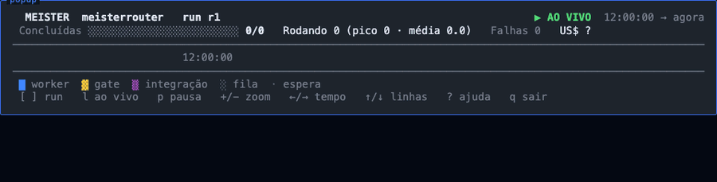

# 🔮 MeisterRouter

🌐 **English** · [Português (Brasil)](README.pt-BR.md)

**A [Herdr](https://herdr.dev) plugin that distributes a plan's tasks across your AI CLI subscriptions and coordinates everything deterministically.**

You pick an **orchestrator LLM** (for example Claude Code) to plan the work. MeisterRouter spreads the tasks over **GitHub Copilot**, **Codex**, **Antigravity (Gemini)** and **Claude**, each one in its own git worktree and in a visible Herdr tab. Every result goes through a **deterministic gate** (tests and lint) and only then is integrated; `main` only moves, by fast-forward, at the very end. The only non-deterministic component is **Jev** (via OpenRouter), which picks the starting lane for each task and judges the outcome.

> [!IMPORTANT]
> **Herdr is a prerequisite**, and the plugin is not enough on its own. MeisterRouter is a Herdr plugin **plus a Python CLI (`meister`)**. `herdr plugin install` registers the plugin but does **not** install the CLI, so its actions fail until `meister` is on your `PATH`. If `meister` is not found, the plugin actions show a notification with the install command (the entry script looks for `meister` in `PATH` and `~/.local/bin`). Use the one-line installer below, which installs both.

📐 **How it works:** see the [diagrams](docs/DIAGRAMAS.md) (components, sequence, routing, failures, gates, states and more; in Portuguese).

> Heads-up: the CLI messages and most of the documentation under `docs/` are currently in Portuguese. This README is in English.

## 👀 See it working

**Timeline** (`prefix+t` in Herdr): one bar per task and per phase (worker, gate, integration), the lane of each one, the Jev line and the cost, live.



**Dashboard** (`prefix+shift+m` in Herdr, or `meister dashboard` at `http://localhost:5050`): per-run metrics, cost, overhead and the task table.


> The images use a **demo run** (synthetic data) produced by MeisterRouter's own renderers; no real project appears in them.

## ✅ Prerequisites

| | What | What for |
|---|---|---|
| **Required** | [Herdr](https://herdr.dev) | MeisterRouter runs as a plugin of it (worker tabs, popups, shortcuts). `curl -fsSL https://herdr.dev/install.sh \| sh` |
| **Required** | At least one subscription-backed AI CLI: `copilot`, `codex`, `agy` (Antigravity/Gemini) or `claude` | These are the workers. `meister setup` shows which ones it found. |
| **Recommended** | An orchestrator LLM with planning, for example **Claude Code** with the [Superpowers](https://github.com/obra/superpowers) plugin | It talks to you, writes the plan in the [plan format](docs/FORMATO_DO_PLANO.md) and triggers Meister. Superpowers is optional: without it the plan only has to follow that format. |
| **Optional** | An OpenRouter API key | Only **Jev** uses it (picks the lane for each task). Without it, set `router: {mode: first}`. |

## 🚀 Install

```bash
curl -fsSL https://raw.githubusercontent.com/CristianonCarvalho/meisterrouter/main/bin/install.sh | bash
```
The installer does everything for you: installs `meister`, links the plugin to Herdr, registers the shortcuts (in a managed block of Herdr's `config.toml`, with a backup) and checks your environment, listing what is still missing (worker CLIs, Jev key). It aborts, with install instructions, if Herdr is not installed. To pin a version (tag) instead of `main`: `... | bash -s -- --version v0.9.0` (or `latest`). You can run `meister setup` again at any time: it does not redo what is already done (`--dry-run` shows what it would do).

**The Jev key** (optional, once; only Jev uses OpenRouter, the workers run on your own subscriptions):
```bash
echo 'OPENROUTER_API_KEY=sk-or-v1-...' >> ~/.meister/.env
```
**Each project**, once, from inside it: `meister setup --project` (creates `CLAUDE.md`, `CODEX.md`, `AGENTS.md`, the hooks and the guard).

Other ways to install (clone, npm, pip) are in [Alternative install and advanced commands](docs/INSTALACAO_E_COMANDOS_AVANCADOS.md) (Portuguese).

## 🛠️ How to use (directly, no commands to type)

After `meister setup --project`, the project has the rules and hooks that **teach your orchestrator LLM to use Meister**. You do not type `meister plan` or `meister orchestrate`:

1. **Open your orchestrator LLM** (Claude Code or Codex) in the project, inside Herdr.
2. **Ask in plain language**, for example: *"I want a date filter on the orders screen"*. With Superpowers it talks to you, designs the solution and writes the plan.
3. **It does the rest**: imports and validates the plan, then runs it with Meister. `CLAUDE.md` and the prompt hook (`UserPromptSubmit`) tell it that the execution method is always Meister, and the **guard** (`PreToolUse`) refuses any direct code edit, so it delegates.
4. **You follow along** in Herdr: each worker opens in a visible tab, and the shortcuts show the rest:

| Shortcut | Opens |
|---|---|
| `prefix+m` | Starts the orchestration in the workspace |
| `prefix+shift+m` | Dashboard popup |
| `prefix+t` | Timeline (Gantt) popup |

5. **It reviews the evidence** (tests, diff) and wraps up. Commit, push and merge still depend on your approval.

If Meister is unavailable (daemon down, no Herdr), the LLM asks before implementing by other means. If a run fails, ask it to run again: tasks already completed are skipped (what to do for each failure is in the [execution manual](docs/MANUAL_DE_EXECUCAO.md), in Portuguese).

Want to review or write a plan by hand, or run the commands yourself? See the [plan format](docs/FORMATO_DO_PLANO.md) and the [advanced commands](docs/INSTALACAO_E_COMANDOS_AVANCADOS.md) (both in Portuguese).

## 🎛️ Choose the models and their order

Each **lane** is a subscription (CLI) with a model. The **order** is the fallback chain, always moving forward: if the first lane fails or runs out of quota, Meister moves to the next. See what is active:
```bash
meister models
```
```
  #  NOME                     HARNESS          MODELO                         CUSTO/1M  STATUS
  1  copilot_luna             copilot          gpt-6-luna                   $0.200  ligada
  2  agy_gemini_flash         agy              gemini-3.8-flash-high        $1.500  ligada
  3  claude_sonnet            claude           sonnet                       $4.000  ligada
  4  codex_luna               codex            gpt-6-luna                   $0.200  desligada
```
(Column labels are in Portuguese: `ligada` = on, `desligada` = off, `CUSTO/1M` = cost per 1M tokens.) To change them, create the project file with the default lanes and edit it:
```bash
meister config init        # writes meister.config.yaml (lanes, order and comments)
```
```yaml
router:
  mode: jev                # jev picks the starting lane of each task; first = always the first lane (no network)
workers:
  tier_order:              # the ORDER of these lines is the fallback chain
    - {name: copilot_luna, harness: copilot, model: gpt-6-luna, cost_per_m_tokens: 0.20, credit_usd: 0.01, max_retries: 2}
    - {name: codex_luna, harness: codex, model: gpt-6-luna, enabled: false, cost_per_m_tokens: 0.20, max_retries: 2}
    - {name: agy_gemini_flash, harness: agy, model: gemini-3.8-flash-high, cost_per_m_tokens: 1.50, max_retries: 2}
    - {name: claude_sonnet, harness: claude, model: sonnet, cost_per_m_tokens: 4.00, max_retries: 1, eligible_classes: [ESCALATE]}
```
(`meister models` lists disabled lanes last; they are not part of the chain.)

| To... | Do this |
|---|---|
| change the **order** | reorder the lines of `tier_order` |
| **enable or disable** a lane | `enabled: true` or `enabled: false` |
| restrict a lane to certain task **classes** (`SMALL`, `MEDIUM`, `HIGH`, `ESCALATE`) | `eligible_classes: [...]` (Jev only sends the lane what it accepts) |
| ignore Jev and always use the first lane | `router.mode: first` |

Note: the project's `tier_order` list **replaces** the default one entirely. After editing, check it with `meister config validate` and `meister models`. The fields and the remaining settings (timeouts, gate, scope) are in [advanced configuration](docs/INSTALACAO_E_COMANDOS_AVANCADOS.md#configuração-avançada).

## 📚 More documentation

All of these pages are in Portuguese for now.
- [Plan format](docs/FORMATO_DO_PLANO.md): how to write or review a plan (Superpowers is recommended, not required), dependencies and parallelism.
- [Alternative install and advanced commands](docs/INSTALACAO_E_COMANDOS_AVANCADOS.md): other ways to install, shortcuts by hand, `plan`/`orchestrate` by hand, `init`/guard, `classify`, `control`, `worker`, `clean`, `--resume`, dashboard and timeline options, advanced configuration, tests and project layout.
- [Diagrams](docs/DIAGRAMAS.md): components, sequence and flows.
- [Execution manual](docs/MANUAL_DE_EXECUCAO.md): what to do in each situation and how to recover from failures.
- [Models and costs](docs/MODELOS_E_CUSTOS.md) and the [CHANGELOG](CHANGELOG.md). Installed version: `meister --version`.

## License

[MIT](LICENSE)
