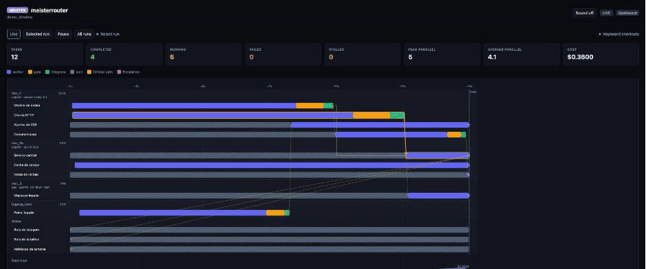
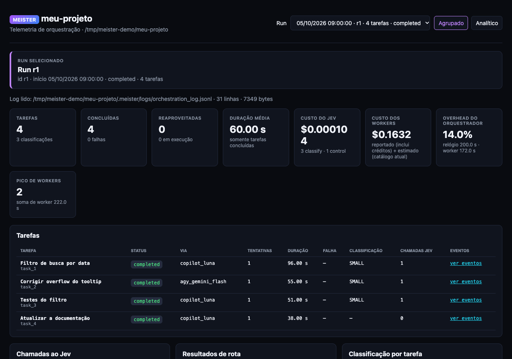

# 🔮 MeisterRouter

🌐 **English** · [Português (Brasil)](README.pt-BR.md)

**A [Herdr](https://herdr.dev) plugin that distributes a plan's tasks across your AI CLI subscriptions and coordinates everything deterministically.**

You pick an **orchestrator LLM** (for example Claude Code) to plan the work. MeisterRouter spreads the tasks over **GitHub Copilot**, **Codex**, **Antigravity (Gemini)** and **Claude**, each one in its own git worktree and in a visible Herdr tab. Every result goes through a **deterministic gate** (tests and lint) and only then is integrated; `main` only moves, by fast-forward, at the very end. The only non-deterministic component is **Jev** (via OpenRouter), which picks the starting lane for each task and judges the outcome.

> [!IMPORTANT]
> **Herdr is a prerequisite** on macOS and Linux (on Windows the host is `process`, without Herdr: see [Windows](docs/advanced.md#windows)), and the plugin is not enough on its own. MeisterRouter is a Herdr plugin **plus a Python CLI (`meister`)**. `herdr plugin install` registers the plugin but does **not** install the CLI, so its actions fail until `meister` is on your `PATH`. If `meister` is not found, the plugin actions show a notification with the install command (the entry script looks for `meister` in `PATH` and `~/.local/bin`). Use the one-line installer below, which installs both.

📐 **How it works:** see the [diagrams](docs/diagrams.md) (components, sequence, routing, failures, gates, states and more).

> Language: the CLI's messages and reports are in English by default. Set `language: pt-BR` in `meister.config.yaml` (or `MEISTER_LANG=pt-BR`) to switch them to Portuguese. The documentation is in English (here and under `docs/`) and in Portuguese (`README.pt-BR.md`, `docs/pt-BR/`).

## 🎯 Why MeisterRouter?

You can already delegate work to subagents inside one AI CLI. MeisterRouter exists for the cases where that stops being enough: **a plan with many tasks, a limited subscription quota, and a need to trust the result without reading every diff.**

| The pain | What MeisterRouter does |
|---|---|
| **Your premium model's quota runs out** doing implementation | The orchestrator only plans and verifies. Tasks run on the lowest-cost lane that fits (list prices range from US$ 0.20 to US$ 8.00 per 1M tokens across the catalog), and expensive lanes are used only on escalation. |
| **"Done" is whatever the agent says** | Every task runs in its own git worktree and must pass a **deterministic gate** (lint, types, the full test suite) before it is integrated. A rejected task gets an automatic repair attempt; `main` only moves, by fast-forward, at the end. |
| **Parallel agents step on each other** | Tasks declare the files they may change. Tasks that share no files run in parallel; a change outside the declared scope is blocked. |
| **A failure at task 7 means starting over** | Runs resume per task: completed tasks are reused, even after you edit the plan. |
| **One CLI, one model, one point of failure** | Copilot, Codex, Antigravity and Claude sit in an ordered fallback chain with rate-limit and circuit-breaker handling. |
| **You can't see what it cost or where the time went** | Live timeline and dashboard with per-task cost, phases (worker, gate, integration) and escalations. |

**When a subagent is the better tool:** a small edit, an exploration, or an interactive debugging session. MeisterRouter adds process (a plan, scoped tasks, a full gate on each one), so it pays off on multi-task plans, not on one-off changes.

## 👀 See it working

**Timeline** (web, opens in its own window when a run starts, at `/timeline`): one bar per task and per phase (worker, gate, integration), grouped by lane, with dependency arrows, escalations and the cost, live.



**Dashboard** (`prefix+shift+m` in Herdr, or `meister dashboard` at `http://localhost:5050`): per-run metrics, cost, overhead and the task table.



> The images use a **demo run** (synthetic data) generated by MeisterRouter itself; no real project appears in them.

## ✅ Prerequisites

| | What | What for |
|---|---|---|
| **Required** | macOS, Linux, or Windows 10/11 (native, **under validation**; requires [Git for Windows](https://git-scm.com/download/win)). On Windows the host is `process` (no Herdr): workers run as plain processes, without tabs, popups or shortcuts. | Where MeisterRouter runs. See [Windows](docs/advanced.md#windows). |
| **Required** (macOS/Linux) | [Herdr](https://herdr.dev) | MeisterRouter runs as a plugin of it (worker tabs, popups, shortcuts). `curl -fsSL https://herdr.dev/install.sh \| sh` |
| **Required** | At least one subscription-backed AI CLI: `copilot`, `codex`, `agy` (Antigravity/Gemini) or `claude` | These are the workers. `meister setup` shows which ones it found. |
| **Recommended** | An orchestrator LLM with planning, for example **Claude Code** with the [Superpowers](https://github.com/obra/superpowers) plugin | It talks to you, writes the plan in the [plan format](docs/plan-format.md) and triggers Meister. Superpowers is optional: without it the plan only has to follow that format. |
| **Optional** | An OpenRouter API key | Only **Jev** uses it (picks the lane for each task). Without it, set `router: {mode: first}`. |

## 🚀 Install

```bash
curl -fsSL https://raw.githubusercontent.com/CristianonCarvalho/meisterrouter/main/bin/install.sh | bash
```
The installer does everything for you: installs `meister`, links the plugin to Herdr, registers the shortcuts (in a managed block of Herdr's `config.toml`, with a backup) and checks your environment, listing what is still missing (worker CLIs, Jev key). It aborts, with install instructions, if Herdr is not installed. To pin a version (tag) instead of `main`: `... | bash -s -- --version v0.9.1` (or `latest`). You can run `meister setup` again at any time: it does not redo what is already done (`--dry-run` shows what it would do).

**The Jev key** (optional, once; only Jev uses OpenRouter, the workers run on your own subscriptions):
```bash
echo 'OPENROUTER_API_KEY=sk-or-v1-...' >> ~/.meister/.env
```
**Each project**, once, from inside it: `meister setup --project` (creates `CLAUDE.md`, `CODEX.md`, `AGENTS.md`, the hooks and the guard).

Other ways to install (clone, npm, pip) are in [Alternative install and advanced commands](docs/advanced.md). On Windows, use `pipx` or `pip` (the installer above is bash): see [Windows](docs/advanced.md#windows).

## 🛠️ How to use (directly, no commands to type)

After `meister setup --project`, the project has the rules and hooks that **teach your orchestrator LLM to use Meister**. You do not type `meister plan` or `meister orchestrate`:

1. **Open your orchestrator LLM** (Claude Code or Codex) in the project, inside Herdr.
2. **Ask in plain language**, for example: *"I want a date filter on the orders screen"*. With Superpowers it talks to you, designs the solution and writes the plan.
3. **It does the rest**: imports and validates the plan, then runs it with Meister. `CLAUDE.md` and the prompt hook (`UserPromptSubmit`) tell it that the execution method is always Meister, and the **guard** (`PreToolUse`) refuses any direct code edit, so it delegates.
4. **You follow along** in Herdr: each worker opens in a visible tab, and the shortcuts show the rest:

| Shortcut | Opens |
|---|---|
| `prefix+m` | Starts the orchestration in the workspace |
| `prefix+shift+m` | Dashboard popup |
| `prefix+t` | Timeline (Gantt) popup |

5. **It reviews the evidence** (tests, diff) and wraps up. Commit, push and merge still depend on your approval.

If Meister is unavailable (daemon down, no Herdr), the LLM asks before implementing by other means. If a run fails, ask it to run again: tasks already completed are skipped (what to do for each failure is in the [execution manual](docs/execution-manual.md)).

Want to review or write a plan by hand, or run the commands yourself? See the [plan format](docs/plan-format.md) and the [advanced commands](docs/advanced.md).

## 🎛️ Choose the models and their order

Each **lane** is a subscription (CLI) with a model. The **order** is the fallback chain, always moving forward: if the first lane fails or runs out of quota, Meister moves to the next. See what is active:
```bash
meister models
```
```
  #  NAME                     HARNESS          MODEL                        EFFORT        COST/1M  STATUS
  1  tier_1                   copilot          claude-haiku-5.5             -          $0.200  enabled
  2  tier_1b                  copilot          gpt-6-luna                   -          $0.200  enabled
  3  tier_2                   agy              gemini-3.8-flash-high        -          $1.500  enabled
  4  tier_3                   claude           sonnet                       -          $4.000  enabled
  5  tier_1c                  codex            gpt-6-luna                   -          $0.200  disabled
  6  tier_3b                  claude           opus                         -          $8.000  disabled
```
(The sample shows the default `language: en` labels: `COST/1M` = cost per 1M tokens, `EFFORT` = reasoning effort, `-` = harness default. With `language: pt-BR` the labels become `NOME`, `MODELO`, `ESFORÇO`, `ligada`/`desligada`.) To change them, create the project file with the default lanes and edit it:
```bash
meister config init        # writes meister.config.yaml (lanes, order and comments)
```
```yaml
router:
  mode: jev                # jev escolhe a via inicial de cada tarefa; first = sempre a primeira (sem rede)
workers:
  tier_order:              # a ORDEM destas linhas é a cadeia de fallback
    - {name: tier_1, harness: copilot, model: claude-haiku-5.5, cost_per_m_tokens: 0.20, credit_usd: 0.01, max_retries: 2}
    - {name: tier_1b, harness: copilot, model: gpt-6-luna, cost_per_m_tokens: 0.20, credit_usd: 0.01, max_retries: 2}
    - {name: tier_1c, harness: codex, model: gpt-6-luna, enabled: false, cost_per_m_tokens: 0.20, max_retries: 2}
    - {name: tier_2, harness: agy, model: gemini-3.8-flash-high, cost_per_m_tokens: 1.50, max_retries: 2}
    - {name: tier_3, harness: claude, model: sonnet, effort: high, cost_per_m_tokens: 4.00, max_retries: 1, eligible_classes: [ESCALATE]}
    - {name: tier_3b, harness: claude, model: opus, enabled: false, cost_per_m_tokens: 8.00, max_retries: 1, eligible_classes: [ESCALATE]}
```
(`meister models` lists disabled lanes last; they are not part of the chain.)

| To... | Do this |
|---|---|
| change the **order** | reorder the lines of `tier_order` |
| **enable or disable** a lane | `enabled: true` or `enabled: false` |
| restrict a lane to certain task **classes** (`SMALL`, `MEDIUM`, `HIGH`, `ESCALATE`) | `eligible_classes: [...]` (Jev only sends the lane what it accepts) |
| ignore Jev and always use the first lane | `router.mode: first` |
| turn a lane **on or off** from the command line | `meister models --enable tier_1c` or `meister models --disable tier_1b` |
| set the **reasoning effort** of a lane | `effort: high` (values depend on the harness, below) |

Note: the project's `tier_order` list **replaces** the default one entirely. After editing, check it with `meister config validate` and `meister models`. The fields and the remaining settings (timeouts, gate, scope) are in [advanced configuration](docs/advanced.md#advanced-configuration).

Effort values per harness:

| Harness | `effort` values (optional; omit it to keep the harness default) |
|---|---|
| `copilot` | none, minimal, low, medium, high, xhigh, max |
| `claude`, `agy` | low, medium, high, xhigh, max |
| `codex` | minimal, low, medium, high, xhigh |

## 📚 More documentation

- [Plan format](docs/plan-format.md): how to write or review a plan (Superpowers is recommended, not required), dependencies and parallelism.
- [Alternative install and advanced commands](docs/advanced.md): other ways to install, shortcuts by hand, `plan`/`orchestrate` by hand, `init`/guard, `classify`, `control`, `worker`, `clean`, `--resume`, dashboard and timeline options, advanced configuration, tests and project layout.
- [Diagrams](docs/diagrams.md): components, sequence and flows.
- [Execution manual](docs/execution-manual.md): what to do in each situation and how to recover from failures.
- [Models and costs](docs/models-and-costs.md) and the [CHANGELOG](CHANGELOG.md). Installed version: `meister --version`.

## License

[MIT](LICENSE)
