# Diagramas do MeisterRouter

Diagramas [Mermaid](https://mermaid.js.org/) do funcionamento do sistema (o GitHub os desenha direto na página).
Cada um foi montado a partir do código; os nomes de módulos, eventos e estados são os reais.
O fluxo completo "do plano à `main`" também está em [`FLUXO_MEISTERROUTER.md`](FLUXO_MEISTERROUTER.md).

| # | Diagrama | Responde a |
|---|---|---|
| 1 | [Visão geral (contexto)](#1-visão-geral-contexto) | Quem participa e o que cada um faz |
| 2 | [Componentes](#2-componentes) | Quais módulos existem e como se ligam |
| 3 | [Sequência de um `orchestrate`](#3-sequência-de-um-orchestrate) | O que acontece, na ordem, de um plano até a `main` |
| 4 | [Escolha da via](#4-escolha-da-via-roteamento) | Como uma subtarefa chega a um worker |
| 5 | [Falhas, timeout e cota](#5-falhas-timeout-e-cota-de-um-worker) | O que acontece quando o worker não termina |
| 6 | [Integração e gates](#6-integração-e-gates) | Por que nada entra na `main` sem verificação |
| 7 | [Estados do run e da subtarefa](#7-estados-do-run-e-da-subtarefa) | Transições válidas e retomada |
| 8 | [Worktrees e branches](#8-worktrees-e-branches) | Onde o código de cada worker vive |
| 9 | [Telemetria e visualização](#9-telemetria-e-visualização) | De onde vêm o dashboard, a linha do tempo e o relatório |
| 10 | [Guard do Claude Code](#10-guard-do-claude-code) | Como a orquestradora é impedida de editar código |
| 11 | [Instalação e integração com o Herdr](#11-instalação-e-integração-com-o-herdr) | O que o instalador e o `init` configuram |

---

## 1. Visão geral (contexto)

Você escolhe uma **LLM orquestradora** (por exemplo o Claude Code) que planeja. O Meister, que é código
determinístico, distribui as tarefas pelas suas **assinaturas** (Copilot, Codex, Antigravity, Claude),
coordena os workers e integra o resultado. A única parte não determinística do Meister é o **Jev**, que só
escolhe a via inicial e julga o resultado.

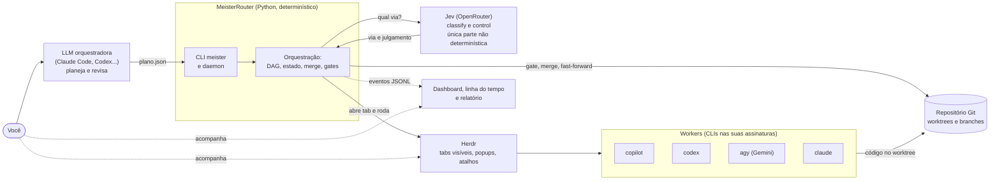

---

## 2. Componentes

Módulos de `meister/` agrupados por responsabilidade. As setas cheias são chamadas; as tracejadas,
leitura de dados.

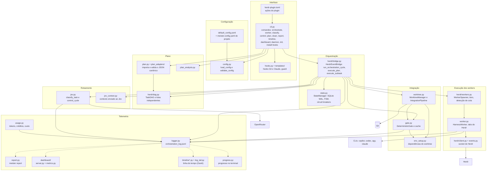

---

## 3. Sequência de um `orchestrate`

Um plano com uma subtarefa, do comando até a `main`. Com várias subtarefas independentes, o bloco
"para cada subtarefa" roda em paralelo, e só o merge é serializado (trava de merge).

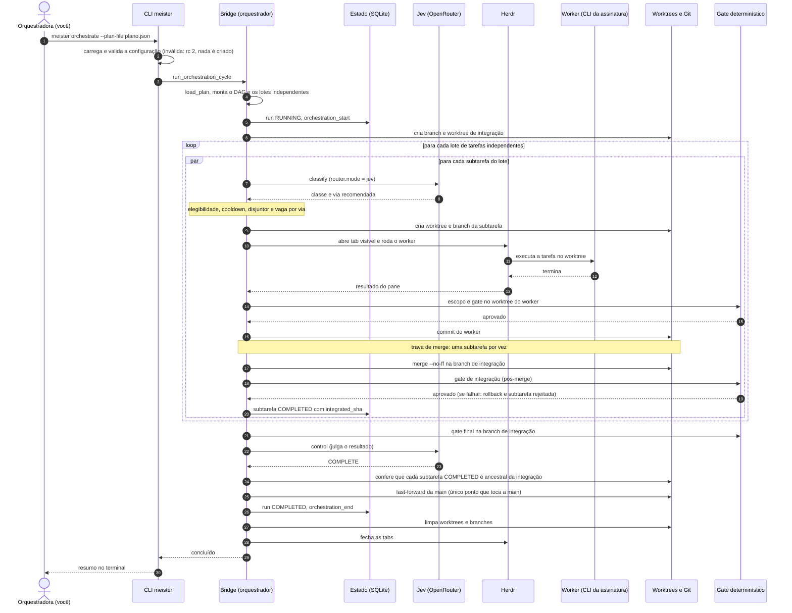

---

## 4. Escolha da via (roteamento)

`router.mode` decide quem escolhe a via inicial. A elegibilidade (`eligible_classes`) e o disjuntor podem
trocar a escolha; o resultado fica registrado em `route_decision`.

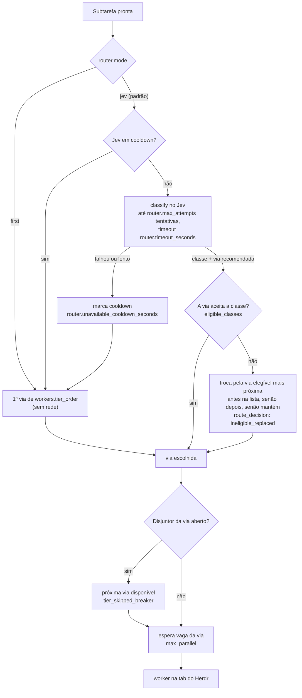

---

## 5. Falhas, timeout e cota de um worker

O pane do worker pode terminar bem, esgotar a cota, sumir ou estourar o tempo. O Meister nunca assume
a implementação: ou integra o trabalho, ou tenta de novo, ou passa para a próxima via.

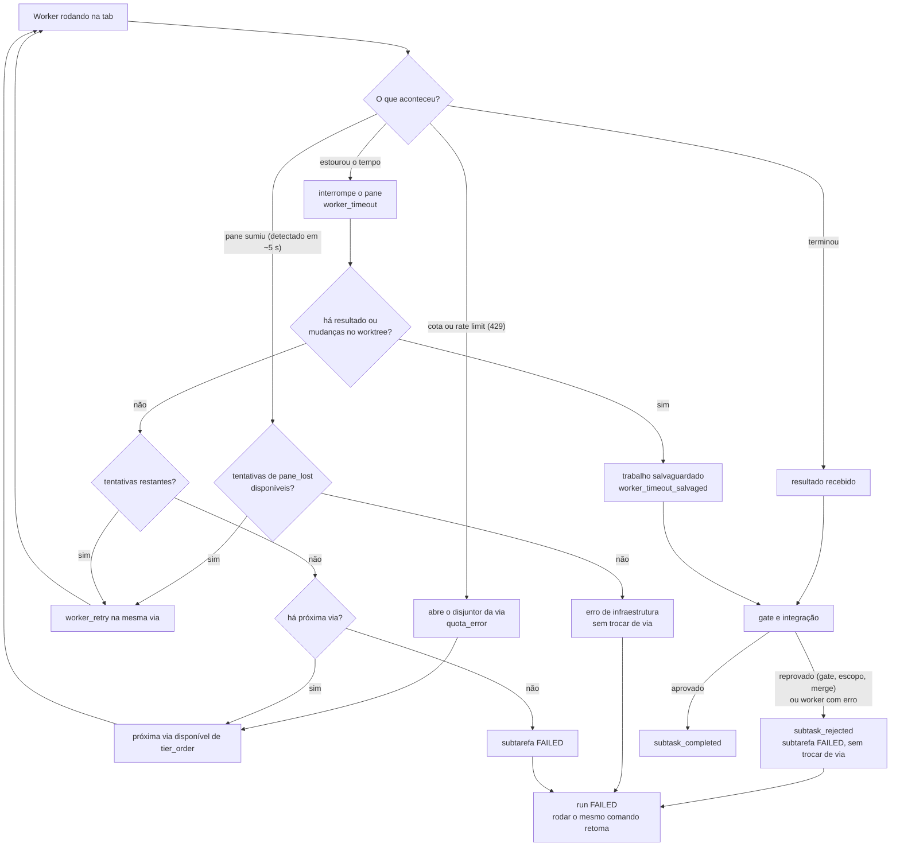

---

## 6. Integração e gates

O **gate** é a verificação determinística (por padrão `ruff` e `pytest`, ou os comandos de `gate.commands`).
Roda em três momentos. Um gate aprovado é guardado em cache pelo conteúdo do código e dos comandos
(`gate.cache`), então uma verificação idêntica não se repete.

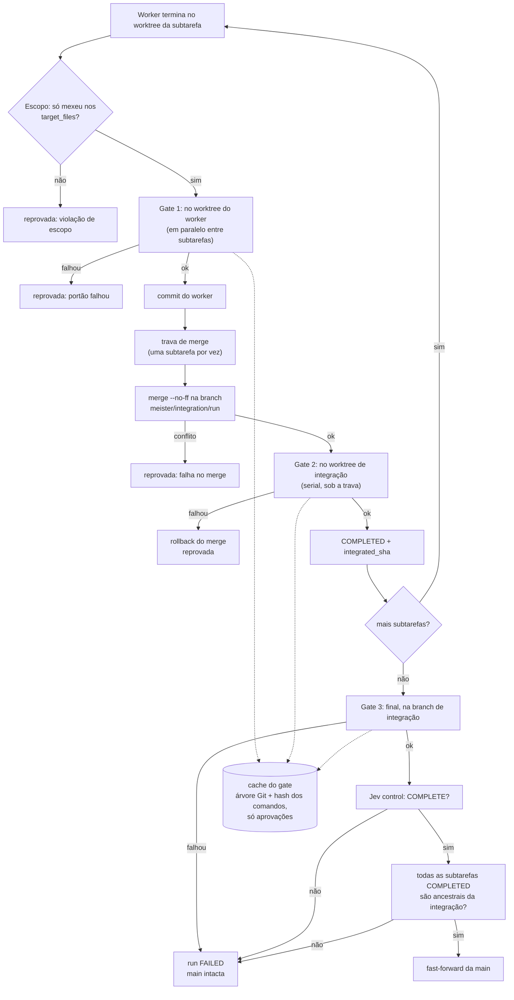

---

## 7. Estados do run e da subtarefa

Máquinas de estado de `meister/state.py` (transições inválidas lançam erro). Um run `FAILED` ou
`RUNNING` volta a `RUNNING` ao rodar o mesmo plano: as subtarefas já `COMPLETED` são puladas.

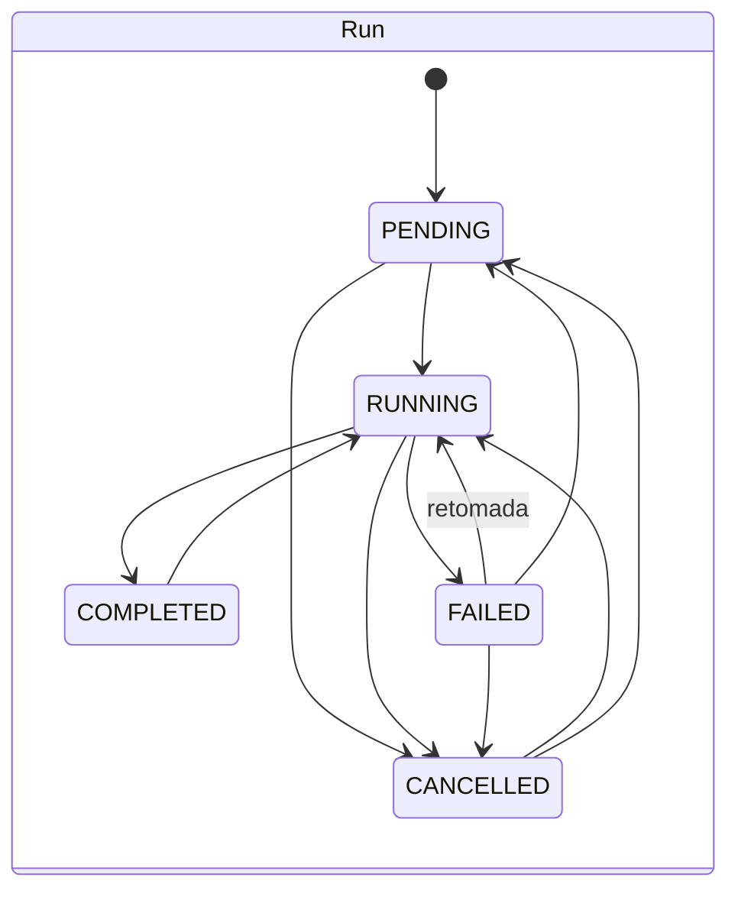

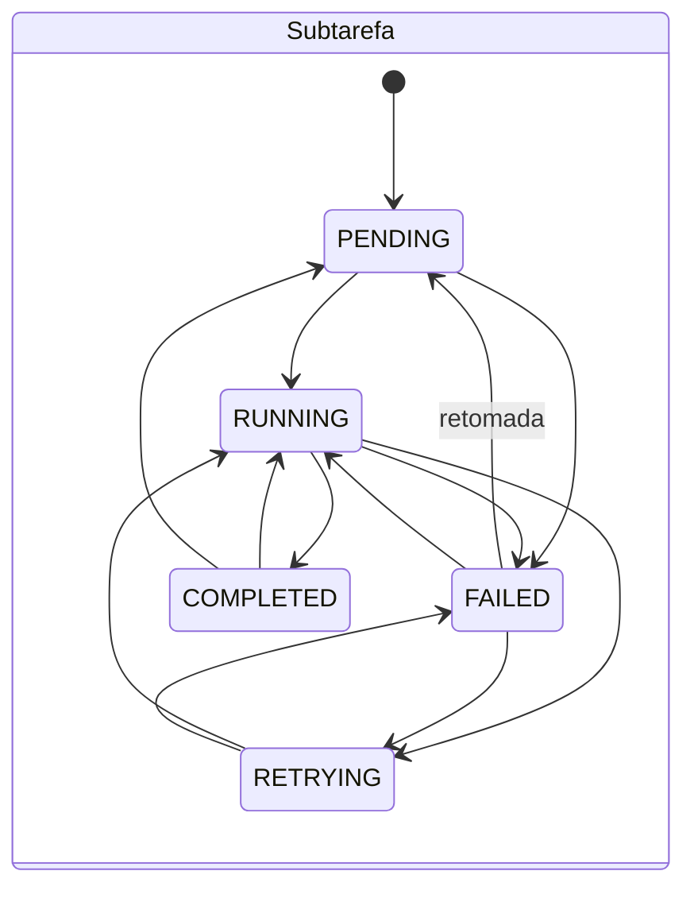

---

## 8. Worktrees e branches

Cada subtarefa trabalha num worktree próprio; o merge acontece numa branch de integração e a `main` só
avança por fast-forward no fim, depois de todos os gates.

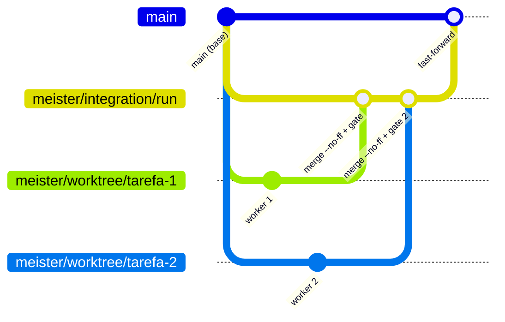

Notas:
- Trabalho não integrado de uma subtarefa descartada fica em `refs/meister/archive/<tarefa>-<data>` e
  é removido pelo Meister depois de 7 dias. `meister clean` apaga as branches antigas.
- O fast-forward é o único passo que toca a `main`. Se qualquer gate falhar, a `main` continua intacta.

---

## 9. Telemetria e visualização

Tudo é gravado como eventos no `orchestration_log.jsonl` (em `.meister/logs/` do projeto, ou em
`MEISTER_LOG_DIR`). As telas só leem esse arquivo: não alteram nada.

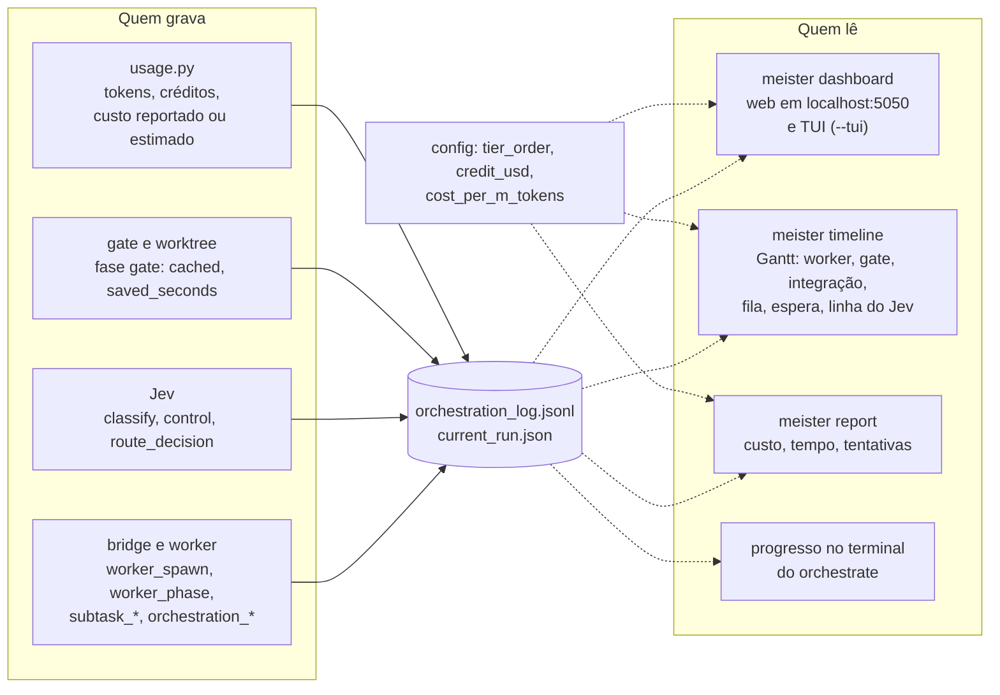

**Dentro da linha do tempo** (`meister timeline`), três camadas separadas:

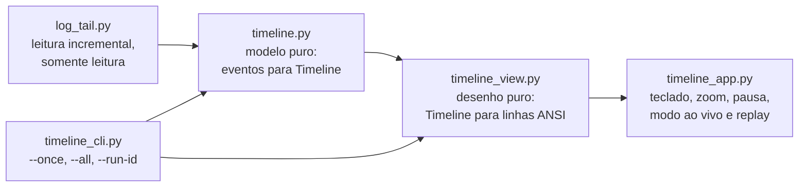

---

## 10. Guard do Claude Code

Hook `PreToolUse` instalado por `meister init --hooks` (ou `install-hooks --claude`). Impede que a LLM
orquestradora escreva código direto: nesses projetos quem implementa são os workers.

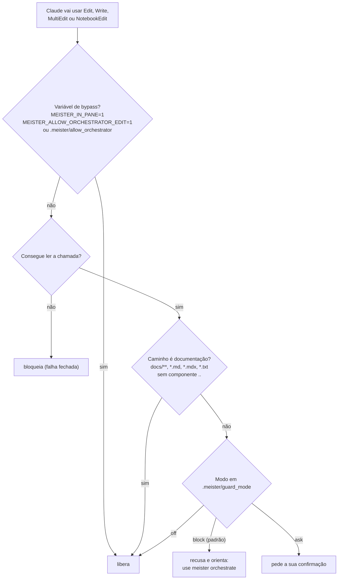

---

## 11. Instalação e integração com o Herdr

O Herdr é pré-requisito. O instalador chama o `meister setup`, que faz o resto e é seguro rodar de novo.

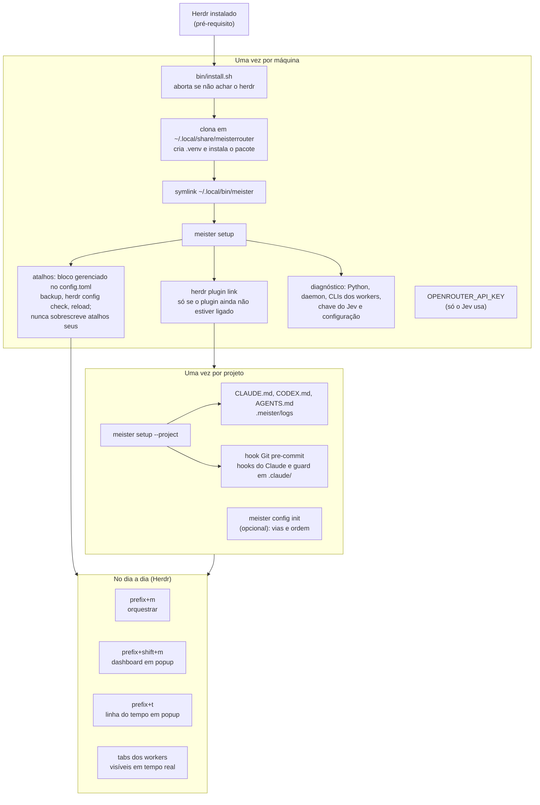
