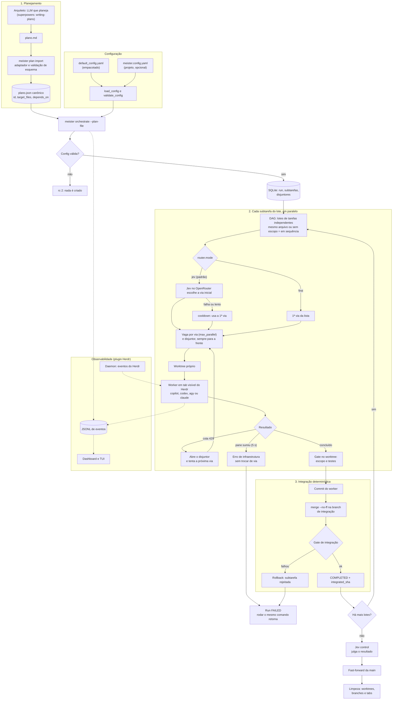

# Fluxo do MeisterRouter

Visão completa do processo, do plano à `main`. Gerado em 2026-10-01 a partir do código mesclado até o PR #17.

## Como ler

- **1. Planejamento:** O plano vira JSON validado, e a configuração é verificada antes de qualquer coisa. Configuração inválida encerra com rc 2 sem criar nada.
- **2. Cada subtarefa:** O Jev (ou a primeira via) escolhe a via inicial. Há uma vaga por via e um worker numa tab visível do Herdr. Cota esgotada abre o disjuntor e passa para a próxima via; um pane que sumiu é detectado em até 5 s.
- **3. Integração:** Nada entra na main sem passar pelos gates. Falha em qualquer etapa deixa a main intacta, e rodar o mesmo comando retoma de onde parou.

## Papéis

| Papel | Quem é | Faz |
|---|---|---|
| Arquiteto | LLM que planeja (hoje a sessão do Claude Code) | Gera o plano |
| Orquestrador | Código Python (`meister orchestrate`), sem LLM | Fila, worktrees, merge, retries, cota |
| Jev | Modelo no OpenRouter | Escolhe a via inicial (`classify`) e julga o resultado (`control`) |
| Workers | `copilot`, `codex`, `agy`, `claude` | Implementam as subtarefas |
