# MeisterRouter Diagrams

Mermaid [diagrams](https://mermaid.js.org/) of how the system works (GitHub renders them directly on the page).
Each one is based on the code; the module, event, and state names are the actual ones.
The complete flow "from plan to `main`" is also shown in [`flow.md`](flow.md).

| # | Diagram | Answers |
|---|---|---|
| 1 | [Overview (context)](#1-overview-context) | Who is involved and what each one does |
| 2 | [Components](#2-components) | Which modules exist and how they connect |
| 3 | [Sequence of an `orchestrate`](#3-sequence-of-an-orchestrate) | What happens, in order, from a plan to `main` |
| 4 | [Lane selection](#4-lane-selection-routing) | How a subtask reaches a worker |
| 5 | [Worker failures, timeout, and quota](#5-worker-failures-timeout-and-quota) | What happens when the worker does not finish |
| 6 | [Integration and gates](#6-integration-and-gates) | Why nothing enters `main` without verification |
| 7 | [Run and subtask states](#7-run-and-subtask-states) | Valid transitions and resume |
| 8 | [Worktrees and branches](#8-worktrees-and-branches) | Where each worker's code lives |
| 9 | [Telemetry and visualization](#9-telemetry-and-visualization) | Where the dashboard, timeline, and report come from |
| 10 | [Claude Code guard](#10-claude-code-guard) | How the orchestrator is prevented from editing code |
| 11 | [Installation and Herdr integration](#11-installation-and-herdr-integration) | What the installer and `init` configure |

---

## 1. Overview (context)

You choose an **orchestrator LLM** (for example, Claude Code) to plan. Meister, which is deterministic code,
distributes tasks across your **subscriptions** (Copilot, Codex, Antigravity, Claude),
coordinates workers, and integrates the result. The only non-deterministic part of Meister is **Jev**, which only
chooses the initial lane and judges the result.

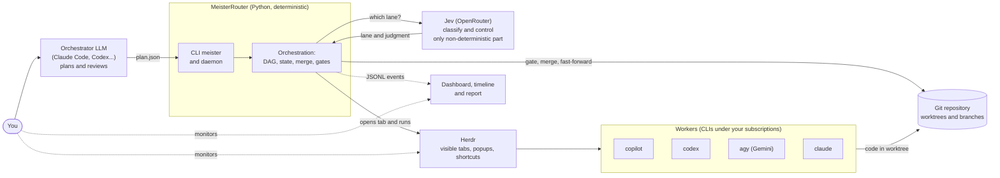

---

## 2. Components

Modules in `meister/` grouped by responsibility. Solid arrows are calls; dashed arrows
are data reads.

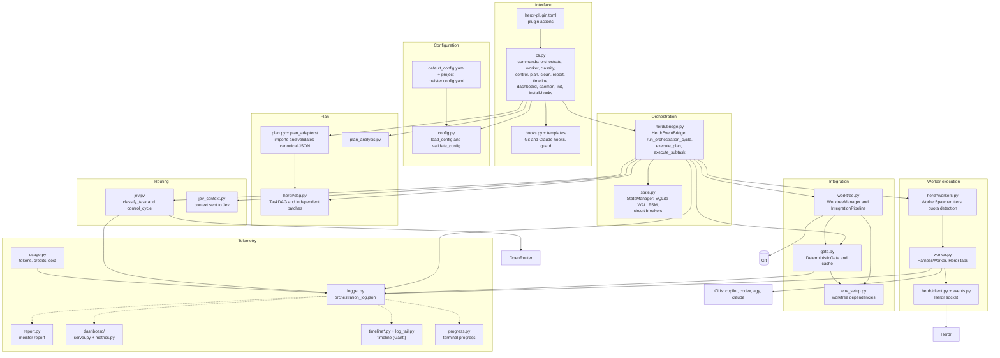

---

## 3. Sequence of an `orchestrate`

A plan with one subtask, from the command to `main`. With multiple independent subtasks, the block
"for each subtask" runs in parallel, and only the merge is serialized (merge lock).

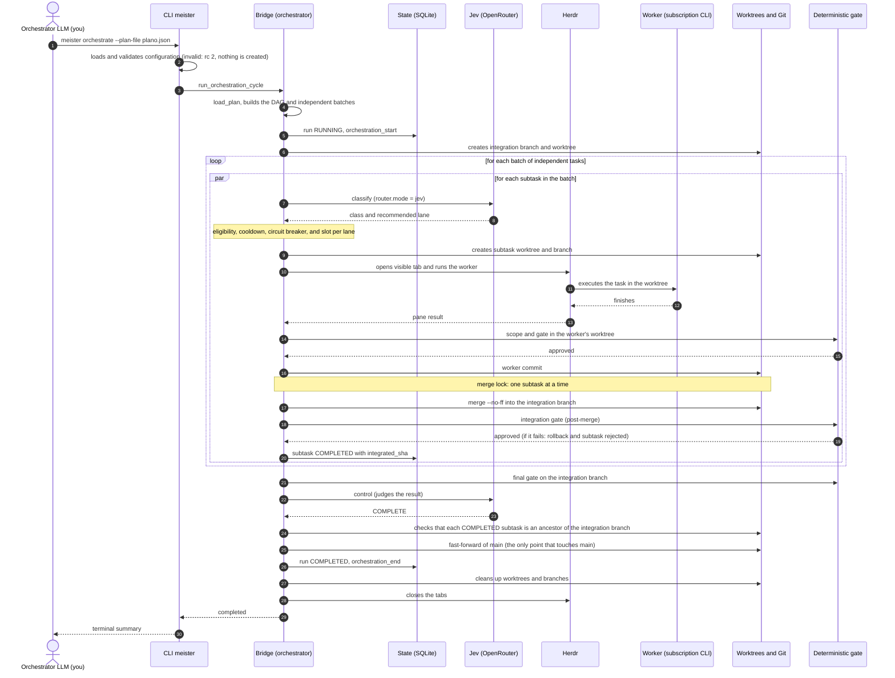

---

## 4. Lane selection (routing)

`router.mode` determines who chooses the initial lane. Eligibility (`eligible_classes`) and the circuit breaker can
change the choice; the result is recorded in `route_decision`.

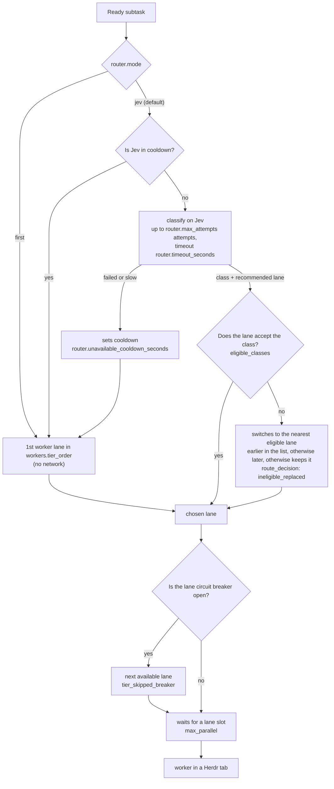

---

## 5. Worker failures, timeout, and quota

The worker pane may finish successfully, run out of quota, disappear, or time out. Meister never assumes
the implementation: it either integrates the work, retries, or moves to the next lane.

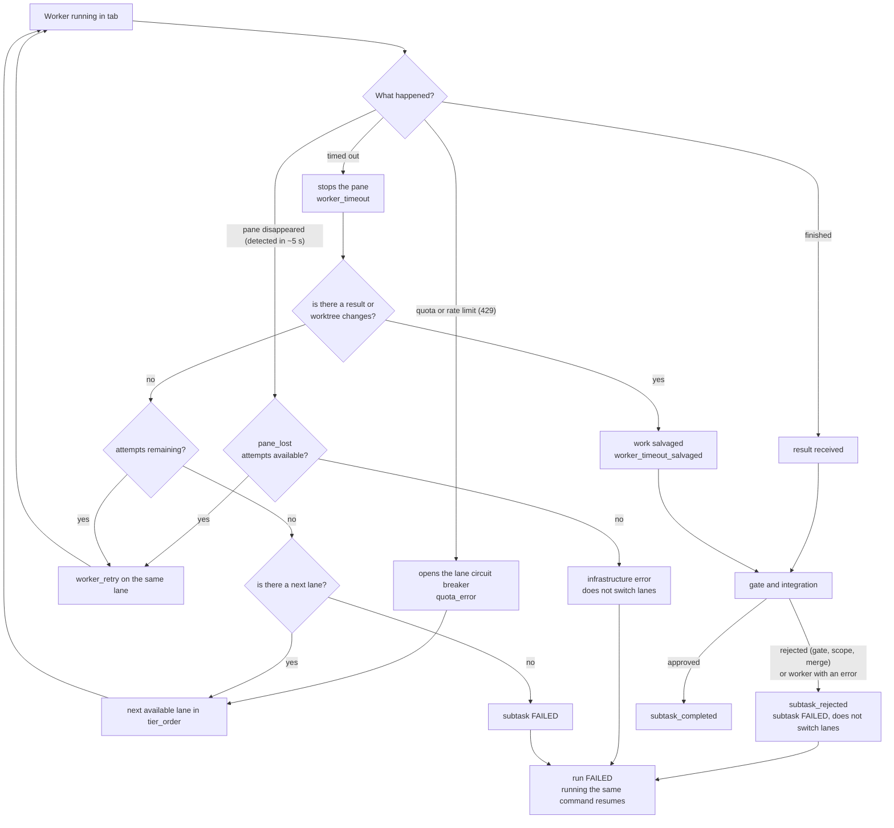

---

## 6. Integration and gates

The **gate** is deterministic verification (by default `ruff` and `pytest`, or the commands in `gate.commands`).
It runs at three points. An approved gate is cached by code content and commands
(`gate.cache`), so identical verification is not repeated.

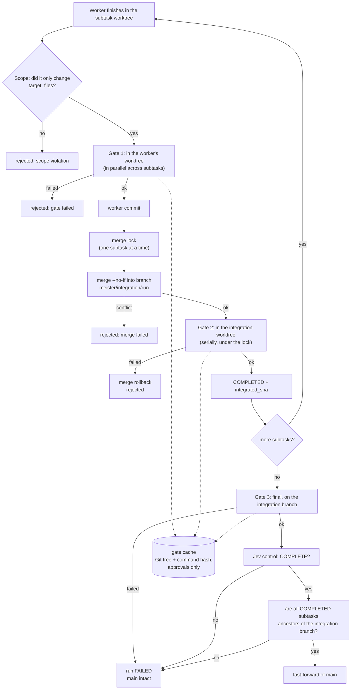

---

## 7. Run and subtask states

State machines in `meister/state.py` (invalid transitions raise an error). A `FAILED` or
`RUNNING` run returns to `RUNNING` when the same plan is run: subtasks already `COMPLETED` are skipped.

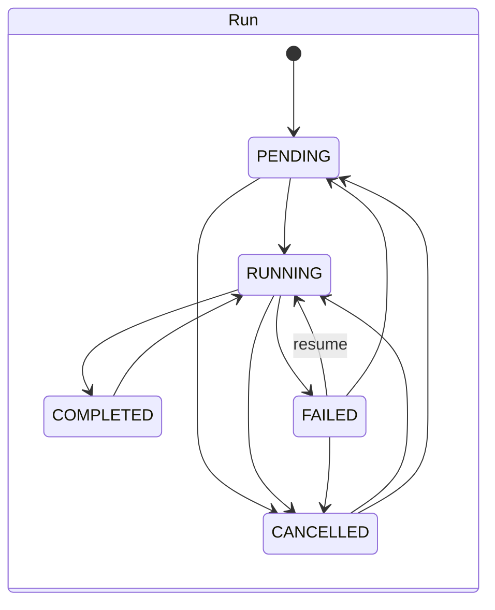

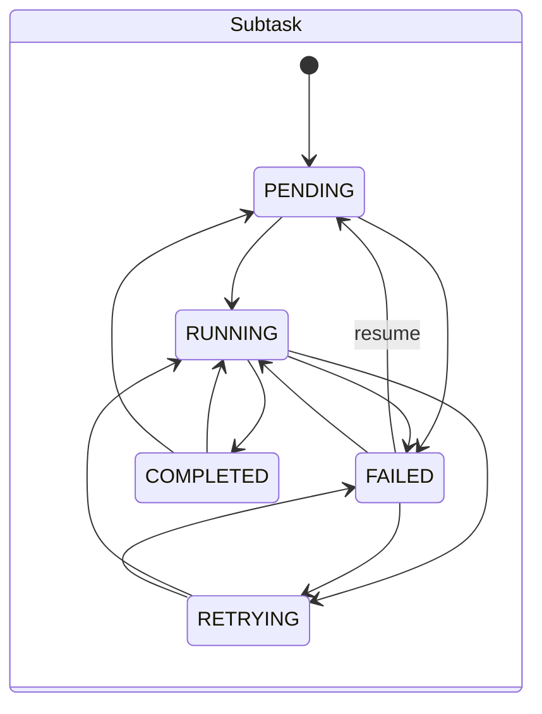

---

## 8. Worktrees and branches

Each subtask works in its own worktree; the merge happens on an integration branch, and `main` only
advances via fast-forward at the end, after all gates.

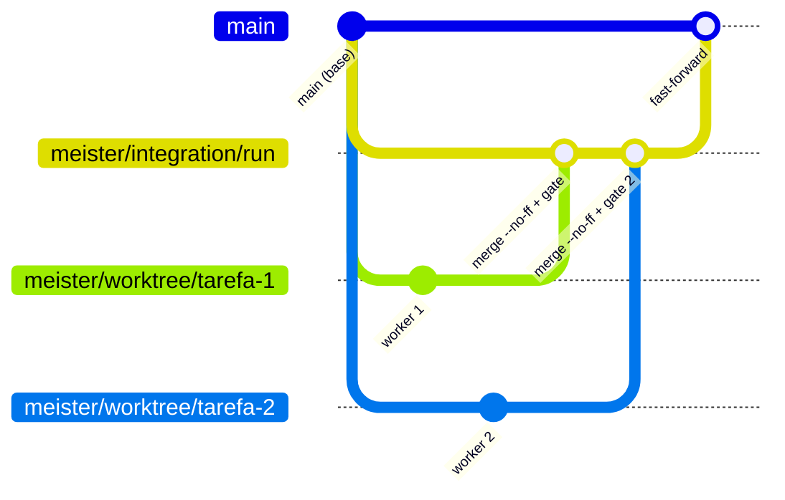

Notes:
- Unintegrated work from a discarded subtask remains in `refs/meister/archive/<tarefa>-<data>` and
  is removed by Meister after 7 days. `meister clean` deletes old branches.
- Fast-forward is the only step that touches `main`. If any gate fails, `main` remains intact.

---

## 9. Telemetry and visualization

Everything is recorded as events in `orchestration_log.jsonl` (in the project's `.meister/logs/`, or in
`MEISTER_LOG_DIR`). The screens only read this file: they do not change anything.

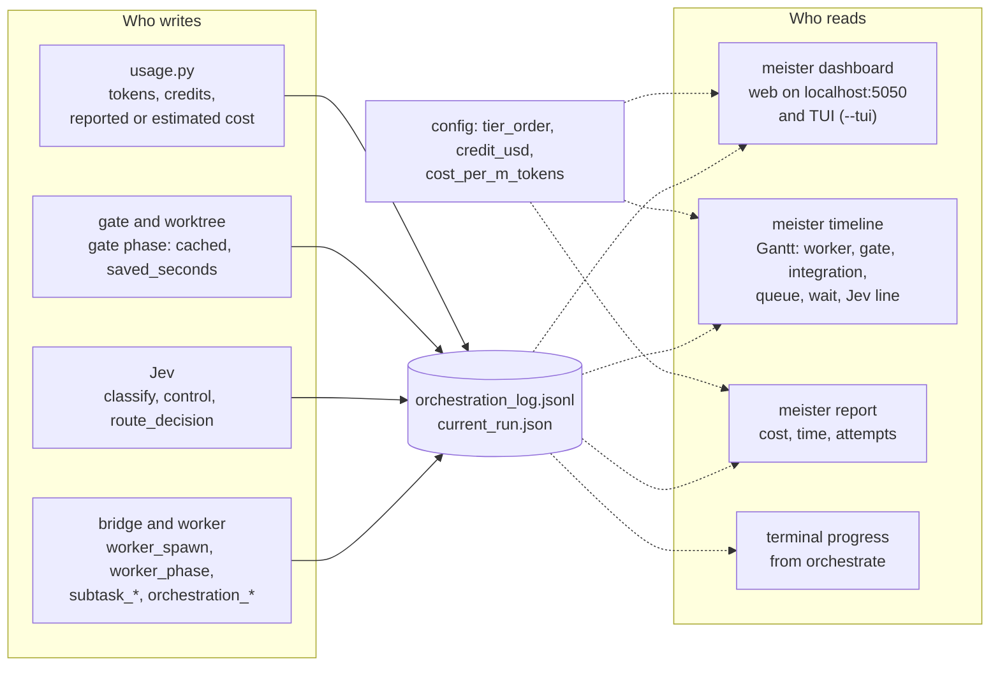

**Inside the timeline** (`meister timeline`), three separate layers:

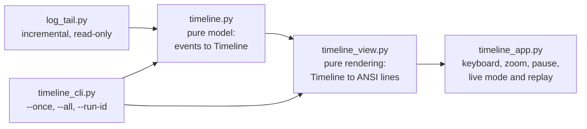

---

## 10. Claude Code guard

`PreToolUse` hook installed by `meister init --hooks` (or `install-hooks --claude`). Prevents the orchestrator LLM
from writing code directly: workers implement changes in these projects.

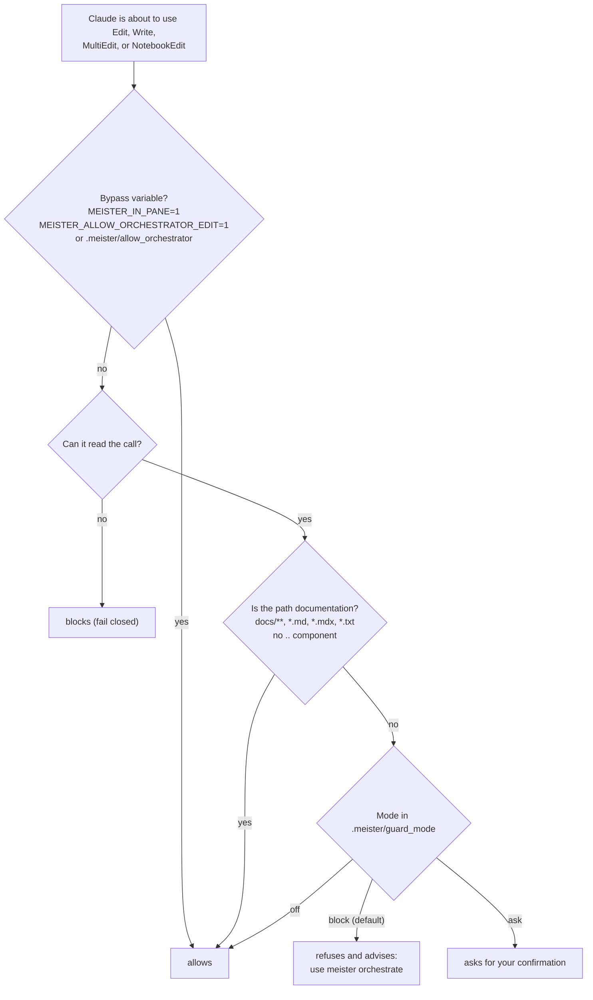

---

## 11. Installation and Herdr integration

Herdr is a prerequisite. The installer calls `meister setup`, which does the rest and is safe to run again.

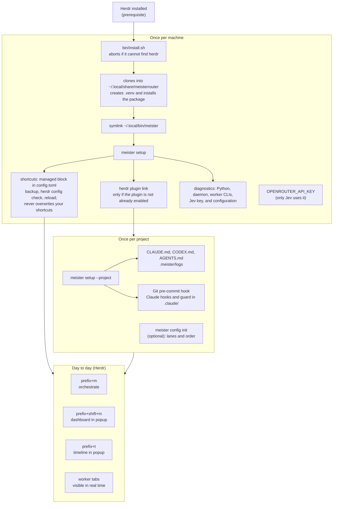
