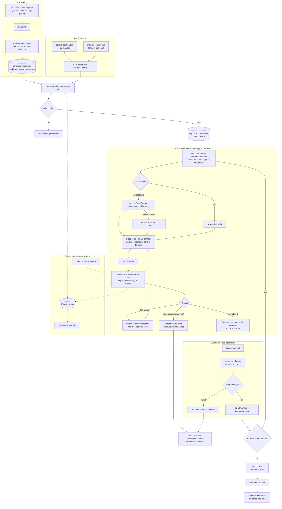

# MeisterRouter Flow

End-to-end view of the process, from the plan to `main`. Generated on 2026-10-01 from the code merged through PR #17.

## How to read

- **1. Planning:** The plan becomes validated JSON, and the configuration is checked before anything else. Invalid configuration exits with rc 2 without creating anything.
- **2. Each subtask:** Jev (or the first lane) chooses the initial lane. There is a slot per lane and a worker in a visible Herdr tab. An exhausted quota opens the circuit breaker and moves to the next lane; a pane that disappears is detected within 5 s.
- **3. Integration:** Nothing enters `main` without passing the gates. A failure at any stage leaves `main` untouched, and running the same command resumes where it stopped.

## Roles

| Role | Who it is | Does |
|---|---|---|
| Architect | LLM that plans (currently the Claude Code session) | Generates the plan |
| Orchestrator | Python code (`meister orchestrate`), no LLM | Queue, worktrees, merge, retries, quota |
| Jev | Model on OpenRouter | Chooses the initial lane (`classify`) and judges the result (`control`) |
| Workers | `copilot`, `codex`, `agy`, `claude` | Implement the subtasks |
