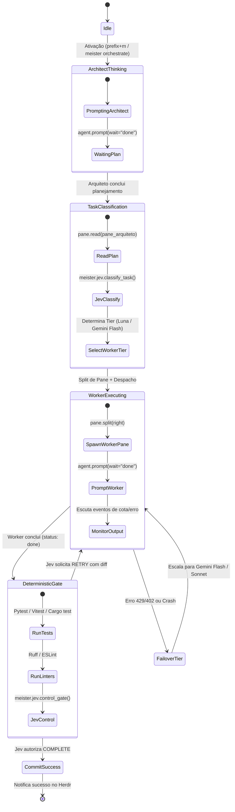

# Especificação de Design: MeisterRouter Herdr Plugin

**Documento:** Design Técnico e Arquitetura do Plugin MeisterRouter para Herdr  
**Data:** 2026-09-26  
**Status:** Em processo de validação com o usuário (Brainstorming / Design Phase)  

---

## 1. Visão Geral e Topologia

O MeisterRouter atua como um plugin nativo para o [Herdr](https://herdr.dev/docs/), combinando o gerenciamento de workspaces de terminal de agentes de IA com o motor de decisões determinísticas e roteamento de modelos de baixo custo (TypeSafe Jev + OpenRouter).

### 1.1 Diagrama de Componentes

```mermaid
flowchart LR
    HerdrHost["Herdr Server<br/>(Processos & Panes)"] <-->|UNIX Socket (JSON-RPC)| HerdrClient["meister/herdr/client.py<br/>(Async Socket Client)"]
    HerdrClient <--> Bridge["meister/herdr/bridge.py<br/>(Event Bridge & Supervisor)"]
    Bridge <--> Decision["meister/jev.py<br/>(OpenRouter Decision Engine)"]
    Bridge <--> Workers["meister/herdr/workers.py<br/>(Worker Spawner & CLI adapters)"]
    Bridge <--> Gate["meister/gate.py<br/>(Linter, Pytest & Git Diff Validator)"]
    Bridge <--> Telemetry["meister/logger.py<br/>(JSONL Logs & Cost Metrics)"]
    Telemetry --> TUIDashboard["meister/herdr/tui.py<br/>(Rich / Textual Overlay Pane)"]
```

---

## 2. Estrutura de Arquivos do Projeto

```
meisterrouter/
├── herdr-plugin.toml               # Manifesto oficial do plugin Herdr
├── setup.py / pyproject.toml       # Entrypoints do pacote ('meister' CLI)
├── meister/
│   ├── __init__.py
│   ├── cli.py                     # CLI estendido (novos subcomandos herdr)
│   ├── jev.py                     # Máquina de decisões TypeSafe Jev via OpenRouter
│   ├── models.py                  # Catálogo de modelos (Luna, Haiku, Gemini, Sonnet)
│   ├── logger.py                  # Gravação de telemetria atômica JSONL
│   ├── gate.py                    # Portão determinístico (Vitest/Pytest/Linter)
│   ├── herdr/                     # [NOVO MÓDULO] Integração com Herdr
│   │   ├── __init__.py
│   │   ├── client.py              # Cliente JSON-RPC assíncrono para o Herdr Socket
│   │   ├── bridge.py              # Supervisor de eventos e transições de estado
│   │   ├── workers.py             # Spawner de workers e adaptadores de CLI
│   │   └── tui.py                 # Dashboard TUI para pane overlay do Herdr
│   └── dashboard/                 # Dashboard Web existente (Flask)
│       └── server.py
└── tests/
    ├── test_herdr_client.py       # Testes unitários do cliente de socket
    ├── test_herdr_bridge.py       # Testes da máquina de estados do orquestrador
    └── test_jev.py                # Testes existentes de decisão
```

---

## 3. Manifesto do Plugin (`herdr-plugin.toml`)

```toml
id = "dev.meisterrouter.orchestrator"
name = "MeisterRouter"
version = "1.0.0"
min_herdr_version = "0.7.0"
description = "Deterministic Multi-Model Orchestration & Cost-Optimized Routing"
platforms = ["linux", "macos"]

# Comando executado assim que o servidor Herdr inicializa
[[startup]]
command = ["meister", "daemon", "--start"]

# Ações acessíveis via menu ou atalhos do Herdr
[[actions]]
id = "classify-task"
title = "MeisterRouter: Classificar Tarefa no Pane Ativo"
contexts = ["workspace", "pane"]
command = ["meister", "herdr-action", "classify"]

[[actions]]
id = "verify-gate"
title = "MeisterRouter: Executar Portão Determinístico"
contexts = ["workspace"]
command = ["meister", "herdr-action", "verify"]

[[actions]]
id = "auto-orchestrate"
title = "MeisterRouter: Iniciar Orquestração Multi-Agente"
contexts = ["workspace"]
command = ["meister", "herdr-action", "orchestrate"]

# Painel Dashboard do MeisterRouter integrado como Overlay no Herdr
[[panes]]
id = "dashboard"
title = "MeisterRouter Telemetry & Cost Dashboard"
placement = "overlay"
command = ["meister", "dashboard", "--tui"]

# Atalhos de teclado no Herdr
[[keys.command]]
key = "prefix+m"
type = "plugin_action"
command = "dev.meisterrouter.orchestrator.auto-orchestrate"
description = "Ativar orquestrador MeisterRouter"

[[keys.command]]
key = "prefix+M"
type = "plugin_action"
command = "dev.meisterrouter.orchestrator.dashboard"
description = "Abrir Dashboard de Custos do MeisterRouter"
```

---

## 4. Cliente Herdr Socket API & Bridge de Eventos (IPC / JSON-RPC)

Nesta seção especificamos como o MeisterRouter se comunica em tempo real com o servidor Herdr.

### 4.1 O Cliente de Socket (`meister/herdr/client.py`)
O Herdr disponibiliza uma API JSON-RPC via socket UNIX local apontada pela variável de ambiente `HERDR_SOCKET_PATH`.

* **Conexão Assíncrona:** Implementado com `asyncio.open_unix_connection(socket_path)`.
* **Envelope de Mensagem JSON-RPC:**
  ```json
  {
    "id": "req_001",
    "method": "pane.split",
    "params": {
      "direction": "right",
      "command": ["meister", "worker", "--model", "luna"]
    }
  }
  ```
* **Métodos Principais Encapsulados:**
  1. `split_pane(direction="right", command=None, split_ratio=0.5) -> str (pane_id)`: Cria um novo terminal lado a lado no Herdr.
  2. `read_pane(pane_id, lines=100) -> str`: Captura a saída recente do terminal para alimentar o contexto do decisor.
  3. `prompt_agent(pane_id, prompt, wait_until="done", timeout_ms=180000)`: Despacha instruções para o agente e aguarda a conclusão sem polling ativo.
  4. `subscribe_events(callback)`: Envia requisição `events.subscribe` para receber notificações reativas do Herdr.
  5. `send_interrupt(pane_id)`: Envia `SIGINT` / `ctrl+c` via `pane.send_keys` caso ocorra falha ou rate limit.

### 4.2 O Event Bridge & State Machine (`meister/herdr/bridge.py`)
O Bridge atua como o supervisor de ciclo de vida:



### 4.3 Tolerância a Falhas e Recuperação de Queda de Conexão
* Se o daemon do MeisterRouter cair, o Herdr mantém todos os terminais e agentes intactos.
* Ao reiniciar (`meister daemon --start`), o cliente reconecta ao `HERDR_SOCKET_PATH`, chama `agent.list` e `pane.list`, reidratando a topologia ativa sem interromper os processos em andamento.
