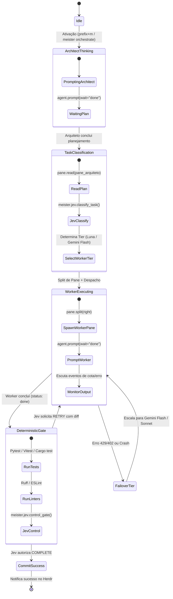
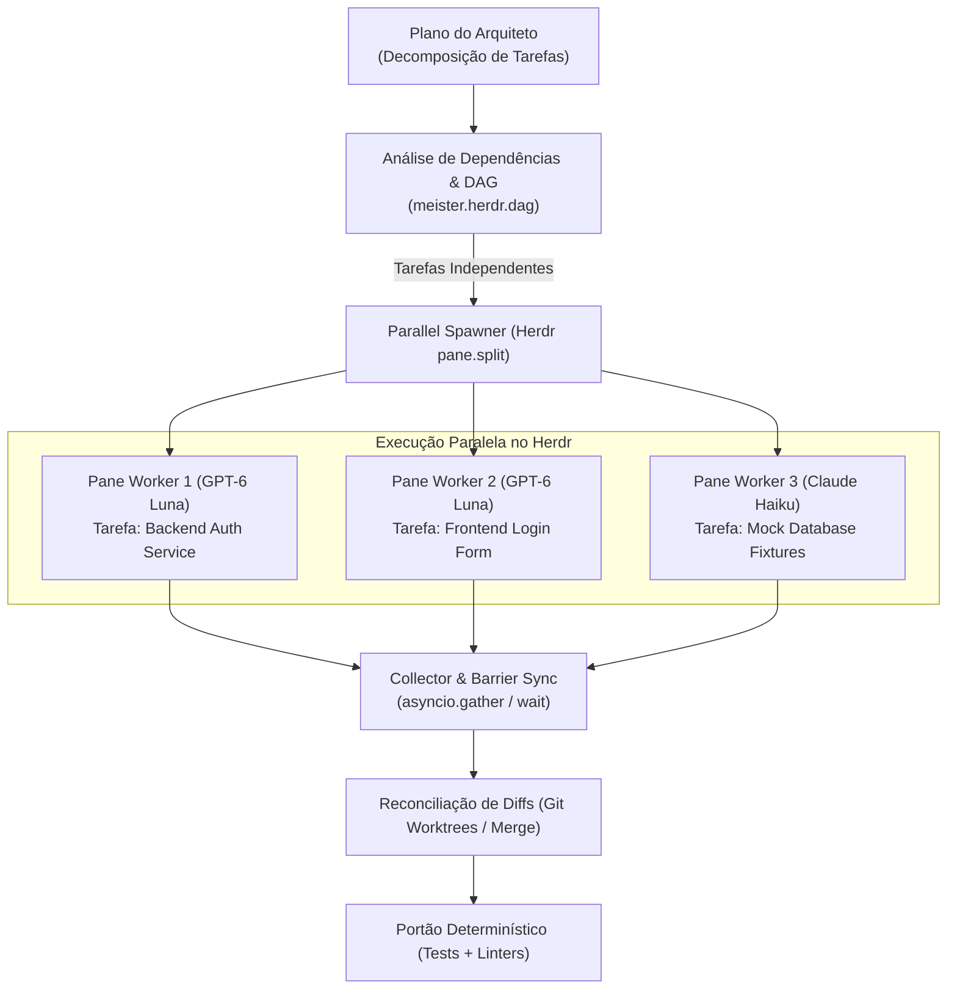

# Especificação de Design: MeisterRouter Herdr Plugin

**Documento:** Design Técnico e Arquitetura do Plugin MeisterRouter para Herdr  
**Data:** 2026-09-26  
**Status:** Em processo de validação com o usuário (Brainstorming / Design Phase)  

---

## 1. Visão Geral e Topologia

O MeisterRouter atua como um plugin nativo para o [Herdr](https://herdr.dev/docs/), combinando o gerenciamento de workspaces de terminal de agentes de IA com o motor de decisões determinísticas e roteamento de modelos de baixo custo (TypeSafe Jev + OpenRouter).

### 1.1 Diagrama de Componentes

```mermaid
flowchart LR
    HerdrHost["Herdr Server<br/>(Processos & Panes)"] <-->|UNIX Socket (JSON-RPC)| HerdrClient["meister/herdr/client.py<br/>(Async Socket Client)"]
    HerdrClient <--> Bridge["meister/herdr/bridge.py<br/>(Event Bridge & Supervisor)"]
    Bridge <--> Decision["meister/jev.py<br/>(OpenRouter Decision Engine)"]
    Bridge <--> Workers["meister/herdr/workers.py<br/>(Worker Spawner & CLI adapters)"]
    Bridge <--> Gate["meister/gate.py<br/>(Linter, Pytest & Git Diff Validator)"]
    Bridge <--> Telemetry["meister/logger.py<br/>(JSONL Logs & Cost Metrics)"]
    Telemetry --> TUIDashboard["meister/herdr/tui.py<br/>(Rich / Textual Overlay Pane)"]
```

---

## 2. Estrutura de Arquivos do Projeto

```
meisterrouter/
├── herdr-plugin.toml               # Manifesto oficial do plugin Herdr
├── setup.py / pyproject.toml       # Entrypoints do pacote ('meister' CLI)
├── meister/
│   ├── __init__.py
│   ├── cli.py                     # CLI estendido (novos subcomandos herdr)
│   ├── jev.py                     # Máquina de decisões TypeSafe Jev via OpenRouter
│   ├── models.py                  # Catálogo de modelos (Luna, Haiku, Gemini, Sonnet)
│   ├── logger.py                  # Gravação de telemetria atômica JSONL
│   ├── gate.py                    # Portão determinístico (Vitest/Pytest/Linter)
│   ├── herdr/                     # [NOVO MÓDULO] Integração com Herdr
│   │   ├── __init__.py
│   │   ├── client.py              # Cliente JSON-RPC assíncrono para o Herdr Socket
│   │   ├── bridge.py              # Supervisor de eventos e transições de estado
│   │   ├── workers.py             # Spawner de workers e adaptadores de CLI
│   │   └── tui.py                 # Dashboard TUI para pane overlay do Herdr
│   └── dashboard/                 # Dashboard Web existente (Flask)
│       └── server.py
└── tests/
    ├── test_herdr_client.py       # Testes unitários do cliente de socket
    ├── test_herdr_bridge.py       # Testes da máquina de estados do orquestrador
    └── test_jev.py                # Testes existentes de decisão
```

---

## 3. Manifesto do Plugin (`herdr-plugin.toml`)

```toml
id = "dev.meisterrouter.orchestrator"
name = "MeisterRouter"
version = "1.0.0"
min_herdr_version = "0.7.0"
description = "Deterministic Multi-Model Orchestration & Cost-Optimized Routing"
platforms = ["linux", "macos"]

# Comando executado assim que o servidor Herdr inicializa
[[startup]]
command = ["meister", "daemon", "--start"]

# Ações acessíveis via menu ou atalhos do Herdr
[[actions]]
id = "classify-task"
title = "MeisterRouter: Classificar Tarefa no Pane Ativo"
contexts = ["workspace", "pane"]
command = ["meister", "herdr-action", "classify"]

[[actions]]
id = "verify-gate"
title = "MeisterRouter: Executar Portão Determinístico"
contexts = ["workspace"]
command = ["meister", "herdr-action", "verify"]

[[actions]]
id = "auto-orchestrate"
title = "MeisterRouter: Iniciar Orquestração Multi-Agente"
contexts = ["workspace"]
command = ["meister", "herdr-action", "orchestrate"]

# Painel Dashboard do MeisterRouter integrado como Overlay no Herdr
[[panes]]
id = "dashboard"
title = "MeisterRouter Telemetry & Cost Dashboard"
placement = "overlay"
command = ["meister", "dashboard", "--tui"]

# Atalhos de teclado no Herdr
[[keys.command]]
key = "prefix+m"
type = "plugin_action"
command = "dev.meisterrouter.orchestrator.auto-orchestrate"
description = "Ativar orquestrador MeisterRouter"

[[keys.command]]
key = "prefix+M"
type = "plugin_action"
command = "dev.meisterrouter.orchestrator.dashboard"
description = "Abrir Dashboard de Custos do MeisterRouter"
```

---

## 4. Cliente Herdr Socket API & Bridge de Eventos (IPC / JSON-RPC)

Nesta seção especificamos como o MeisterRouter se comunica em tempo real com o servidor Herdr.

### 4.1 O Cliente de Socket (`meister/herdr/client.py`)
O Herdr disponibiliza uma API JSON-RPC via socket UNIX local apontada pela variável de ambiente `HERDR_SOCKET_PATH`.

* **Conexão Assíncrona:** Implementado com `asyncio.open_unix_connection(socket_path)`.
* **Envelope de Mensagem JSON-RPC:**
  ```json
  {
    "id": "req_001",
    "method": "pane.split",
    "params": {
      "direction": "right",
      "command": ["meister", "worker", "--model", "luna"]
    }
  }
  ```
* **Métodos Principais Encapsulados:**
  1. `split_pane(direction="right", command=None, split_ratio=0.5) -> str (pane_id)`: Cria um novo terminal lado a lado no Herdr.
  2. `read_pane(pane_id, lines=100) -> str`: Captura a saída recente do terminal para alimentar o contexto do decisor.
  3. `prompt_agent(pane_id, prompt, wait_until="done", timeout_ms=180000)`: Despacha instruções para o agente e aguarda a conclusão sem polling ativo.
  4. `subscribe_events(callback)`: Envia requisição `events.subscribe` para receber notificações reativas do Herdr.
  5. `send_interrupt(pane_id)`: Envia `SIGINT` / `ctrl+c` via `pane.send_keys` caso ocorra falha ou rate limit.

### 4.2 O Event Bridge & State Machine (`meister/herdr/bridge.py`)
O Bridge atua como o supervisor de ciclo de vida:



### 4.3 Tolerância a Falhas e Recuperação de Queda de Conexão
* Se o daemon do MeisterRouter cair, o Herdr mantém todos os terminais e agentes intactos.
* Ao reiniciar (`meister daemon --start`), o cliente reconecta ao `HERDR_SOCKET_PATH`, chama `agent.list` e `pane.list`, reidratando a topologia ativa sem interromper os processos em andamento.

---

## 5. Ciclo de Orquestração, Handoff e Failover Automático

Nesta seção definimos o fluxo de dados, a troca de contexto entre modelos e o mecanismo de contingência.

### 5.1 O Envelope de Contexto Unificado (*Unified Context Envelope - UCE*)
Para que um modelo econômico (ex: GPT-6 Luna) possa implementar o que um modelo arquiteto (ex: Claude Sonnet) planejou sem alucinar, o MeisterRouter compila o **UCE**:

```python
@dataclass
class UnifiedContextEnvelope:
    task_id: str
    architect_model: str
    objective: str
    actionable_steps: list[str]
    target_files: list[str]
    verification_commands: list[str]
    git_base_sha: str
    accumulated_diff: str = ""
    retry_count: int = 0
```

### 5.2 Configuração Declarativa de Modelos e Ordem de Workers (`meister.config.yaml`)
Todos os modelos (orquestrador, arquiteto e a escada sequencial de workers) são 100% configuráveis via arquivo declarativo `meister.config.yaml` na raiz do projeto (com fallback para variáveis de ambiente):

```yaml
version: "1.0"

# 1. Configuração do Orquestrador / Modelo Mestre de Decisões
master:
  provider: "openrouter"
  model: "typesafe/jev-1.13" # Decisor determinístico tipado
  temperature: 0.0
  api_key_env: "OPENROUTER_API_KEY"

# 2. Configuração do Modelo Arquiteto (Decomposição e Planejamento)
architect:
  harness: "claude" # "claude", "codex", "mcp" ou "native"
  model: "anthropic/claude-3-7-sonnet"
  prompt_template: "templates/architect_prompt.md"

# 3. Ordem Sequencial de Workers e Fallback (do mais econômico ao mais potente)
workers:
  # Ordem prioritária de alocação de tarefas e escalonamento
  tier_order:
    - name: "luna"
      harness: "native"
      model: "openai/gpt-6-luna"
      cost_per_m_tokens: 0.077
      max_retries: 2
      best_for: ["small_edits", "single_file", "css_fixes", "unit_test_additions"]

    - name: "haiku"
      harness: "claude"
      model: "anthropic/claude-3-5-haiku-20241022"
      cost_per_m_tokens: 0.77
      max_retries: 2
      best_for: ["medium_features", "refactoring"]

    - name: "gemini_flash"
      harness: "native"
      model: "google/gemini-2.5-flash"
      cost_per_m_tokens: 0.577
      max_retries: 2
      best_for: ["deep_reasoning", "complex_algorithms", "hard_bugs"]

    - name: "sonnet"
      harness: "claude"
      model: "anthropic/claude-3-7-sonnet"
      cost_per_m_tokens: 3.00
      max_retries: 1
      best_for: ["architectural_recovery", "systemic_regressions"]

# 4. Políticas de Concorrência e Paralelismo de Tarefas
concurrency:
  parallel_tasks: true             # Ativa execução paralela sempre que o plano permitir
  max_parallel_workers: 4          # Limite de panes simultâneos abertos no Herdr
  layout_strategy: "tiled"         # "tiled" (grade equilibrada) ou "columns" (colunas verticais)
  isolation_mode: "git_worktree"   # Garante isolamento de workspace quando tarefas tocarem arquivos distintos
```

### 5.3 Execução Paralela de Subtarefas Concorrentes no Herdr

Quando o Arquiteto analisa o objetivo do usuário e gera o plano de execução, o MeisterRouter analisa a matriz de dependências entre as subtarefas gerando um **Grafo Acíclico Dirigido (DAG)**:



#### Regras de Paralelismo:
1. **Detecção de Concorrência:** Se duas ou mais subtarefas operam em diretórios/arquivos não sobrepostos (ex: `backend/` vs `frontend/` ou `src/` vs `tests/`), o MeisterRouter marca-as como `PARALLEL_CAPABLE`.
2. **Multi-Pane Split Dinâmico no Herdr:**
   * O cliente dispara `pane.split` sucessivos no Herdr até o limite de `max_parallel_workers` (ex: dividindo a tela em quadrantes 2x2 ou colunas verticais).
   * Cada pane executa seu respectivo worker de forma assíncrona com `agent.prompt(wait="done")`.
3. **Barreira de Sincronização (*Barrier Sync*):** O orquestrador aguarda todos os workers paralelos terminarem. Se um worker falhar, apenas aquele sub-pane sofre retry ou escalonamento, mantendo o progresso dos demais.
4. **Merge & Validação:** Após a conclusão paralela, as alterações são mescladas e o portão determinístico valida o conjunto completo com a suíte de testes.

### 5.4 Spawner de Workers Híbrido (`meister/herdr/workers.py`)
Suporta despachar tanto o worker nativo do MeisterRouter quanto CLIs de terceiros:
1. **Worker Nativo MeisterRouter (`meister worker --model <luna|gemini_flash>`):**
   * Rápido, headless, consome diretamente a API do OpenRouter.
   * Aplica edições via diffs unificados e executa os testes locais.
2. **Harness de Terceiros Parametrizado:**
   * Se o modelo configurado exigir uma CLI instalada (ex: Claude Code ou Codex), o comando despachado no `pane.split` respeita o campo `harness` e `model` declarados no `meister.config.yaml`.

### 5.5 Mecanismo de Failover Imediato com Escalonamento Declarativo
Se qualquer worker falhar por exaustão de cota (HTTP 429/402) ou limite de retries:
1. O supervisor consulta a lista declarativa `workers.tier_order`.
2. Identifica o próximo modelo da hierarquia configurada (ex: `luna` -> `gemini_flash` -> `sonnet`).
3. Interrompe o pane atual com `pane.send_keys("ctrl+c")` e `pane.close`.
4. Abre o novo pane com o modelo superior e reinjeta o UCE atualizado com o diff pendente.

### 5.6 Portão Determinístico e Feedback no Herdr (`meister/gate.py`)
* Nenhuma tarefa é declarada concluída sem evidência determinística.
* O portão detecta automaticamente a suíte de testes do repositório (`pytest`, `npm test`, `cargo test`, `vitest`).
* O resultado é submetido ao `meister control` (TypeSafe Jev Decisions).
* Aprovado o commit, o MeisterRouter exibe um aviso nativo no Herdr usando a API `notification.show(message="Tarefa implementada e verificada com sucesso!")`.

---

## 6. Interface do Usuário no Herdr (Ações, Atalhos e TUI Dashboard)

Nesta seção definimos a experiência direta do desenvolvedor dentro do Herdr.

### 6.1 Ações do Menu e Atalhos de Teclado
As ações declaradas no `herdr-plugin.toml` aparecem no menu de contexto do Herdr e possuem atalhos rápidos:

1. **`prefix+m` → `auto-orchestrate`:**
   * Inicia o fluxo autônomo: lê o pane atual, decide o worker no Jev, divide o terminal com `pane.split` e executa a tarefa até a verificação determinística.
2. **`prefix+M` → `dashboard`:**
   * Abre o pane overlay de telemetria e custos sobre a tela atual. Ao pressionar `q` ou `Esc`, fecha o overlay e restaura o foco anterior.
3. **Ações no Menu de Contexto (Botão Direito no Herdr):**
   * *MeisterRouter: Classificar Tarefa no Pane Ativo*
   * *MeisterRouter: Executar Portão Determinístico*

### 6.2 Dashboard TUI Nativo no Terminal (`meister/herdr/tui.py`)
Quando o desenvolvedor abre o painel overlay (`placement = "overlay"`), ele vê uma interface rica no terminal:

```
┌──────────────────────── MeisterRouter Live Telemetry ────────────────────────┐
│ Workspace: meisterrouter                      Status: ORCHESTRATING (Luna)   │
├──────────────────────────────────────────────────────────────────────────────┤
│ ATIVIDADE ATUAL                                                              │
│ • Arquiteto: Claude Code (Pane 1) -> Planejamento concluído                  │
│ • Worker: GPT-6 Luna (Pane 2) -> Implementando teste unitário de auth        │
│ • Decisão Jev: Nível MEDIUM ($0.077/M tokens)                                │
├──────────────────────────────────────────────────────────────────────────────┤
│ MÉTRICAS ECONÔMICAS DA SESSÃO                                                │
│ • Tokens Consumidos: 42,500 tokens                                           │
│ • Custo Efetivo MeisterRouter: $0.0033                                       │
│ • Custo Estimado Tradicional (Sonnet Puro): $0.1275                          │
│ • Economia Gerada: 97.4% 🟢                                                  │
├──────────────────────────────────────────────────────────────────────────────┤
│ ÚLTIMOS EVENTOS                                                              │
│ [14:48:10] Task Classified: MEDIUM -> Selected: gpt-6-luna                   │
│ [14:48:12] Herdr Split: Pane 2 criado com sucesso                            │
│ [14:48:50] Worker completed task -> Running Deterministic Gate               │
├──────────────────────────────────────────────────────────────────────────────┤
│ [O] Abrir Dashboard Web completo (http://localhost:5050)   [Q] Fechar Overlay│
└──────────────────────────────────────────────────────────────────────────────┘
```

### 6.3 Integração com Notificações do Herdr
Em vez de poluir o terminal ativo com logs secundários, o MeisterRouter emite avisos discretos através da API `notification.show`:
* Notificação de sucesso: *"MeisterRouter: Portão determinístico passou 100%. Commit realizado."*
* Notificação de contingência: *"MeisterRouter: Cota atingida no Luna. Escalonando para Gemini 3.8 Flash automaticamente."*

---

## 7. Estratégia de Testes e Validação

Para assegurar confiabilidade estrita sem depender do servidor Herdr real durante a suíte de CI/CD:

### 7.1 Mock do Servidor Herdr (`MockHerdrServer`)
* Implementado em `tests/mocks/mock_herdr_server.py`.
* Cria um servidor UNIX Domain Socket temporário em pytest fixtures.
* Responde às chamadas JSON-RPC (`pane.split`, `pane.read`, `events.subscribe`, `agent.prompt`).
* Simula emissão de eventos assíncronos (`pane.agent_status_changed`, `working` -> `done` e erro de quota).

### 7.2 Casos de Testes Críticos
1. **`test_herdr_client_connect_and_split`:** Testa conexão ao socket e criação de splits.
2. **`test_event_bridge_orchestration_loop`:** Simula fluxo completo (Arquiteto planeja -> Jev classifica -> Worker executa -> Portão aprova).
3. **`test_failover_on_quota_error`:** Injeta erro simulado de rate limit e valida se o supervisor mata o pane e escala para o Gemini 3.8 Flash.
4. **`test_deterministic_gate_failure`:** Simula falha em teste unitário e verifica se o Jev aciona `RETRY` em vez de comitar.

---

## 8. Plano de Implementação e Fases

### Fase 1: Fundação do Plugin e Cliente de Socket
1. Criar `herdr-plugin.toml` na raiz do repositório.
2. Implementar `meister/herdr/client.py` com suporte assíncrono a JSON-RPC sobre UNIX Domain Sockets.
3. Testes unitários com mock de socket.

### Fase 2: Event Bridge, Orquestração e Failover
1. Implementar `meister/herdr/bridge.py` integrando os eventos do Herdr com `meister.jev`.
2. Implementar `meister/herdr/workers.py` para despachar o worker nativo ou agentes CLI.
3. Implementar a lógica de hot-swap e escalonamento de modelos por cota.

### Fase 3: Dashboard TUI e Ações do Herdr
1. Implementar `meister/herdr/tui.py` para renderização do painel no pane overlay do Herdr.
2. Configurar os subcomandos na CLI do MeisterRouter (`meister daemon`, `meister herdr-action`, `meister dashboard --tui`).
3. Validar a instalação e link no Herdr via `herdr plugin link .`.
